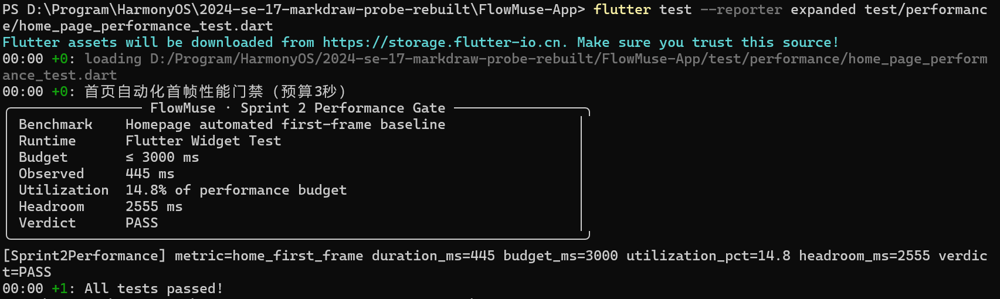
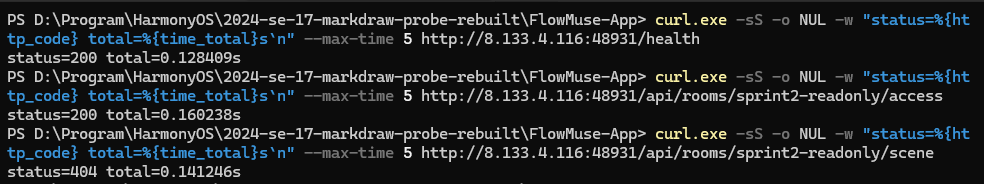

# Sprint 2 质量门禁证据

更新时间：2026-07-15

## 1. 测试覆盖

执行命令：

```powershell
cd FlowMuse-App
flutter test --coverage --reporter compact
```

执行结果：`134 tests passed`。

本次以会造成数据丢失、跨端异常或核心交互失效的纯逻辑模块作为“核心函数”范围。覆盖率来自 `FlowMuse-App/coverage/lcov.info`：

| 核心模块 | 行覆盖率 |
| --- | ---: |
| 协作变更累加器 `change_accumulator.dart` | 100% |
| 外部文档入站校验 `external_document_ingress.dart` | 100% |
| 协作环境配置 `collaboration_config.dart` | 90% |
| 指针压感归一化 `pointer_pressure.dart` | 87.5% |
| 分享载荷校验 `share_payload.dart` | 87.0% |
| 编辑器偏好序列化 `editor_preferences.dart` | 80.8% |
| 分页视口约束 `viewport_clamp.dart` | 78.9% |

以上核心模块均达到 60% 门禁。全仓库（包含大量页面布局、平台通道和生成式 UI 分支）的行覆盖率为 17.8%，不与“核心函数覆盖率”混淆。

### 已覆盖的边界场景

1. `.env` 未初始化时，协作配置回退到安全默认值，不阻塞 Widget 测试和非主入口调用。
2. PDF 背景不可被单击、框选或全选，同时背景标记在序列化后仍保留。
3. PDF 分页模式下，页面外的图形创建被拒绝；无界模式仍允许任意坐标创建。
4. 协作累加窗口按 `version/versionNonce` 合并，并保证删除墓碑覆盖旧版本。
5. 外部文件超过 20 MiB 时拒绝入站，入站队列保持三项 FIFO 上限。
6. 触摸和鼠标产生的合成压感被忽略，手写笔压感被归一化。

### 本次修正

- 更新旧测试使用的指针事件 API和当前资料库 UI 断言。
- 测试使用内存态资料库替身，不访问真实数据库或网络。
- 修复笔记卡片操作按钮外围区域无法命中的问题。
- 协作配置允许在 `.env` 尚未初始化时使用默认值。

## 2. 代码走查

走查范围：当前分支最近 30 个提交，重点检查三位成员最近负责的协作/Web、智能识别、编辑器工具栏模块。

| 被审查人 | 抽查提交/模块 | 审查人 |
| --- | --- | --- |
| qinyre | `f96bc8a`、`71f91ce`、`f9e3a45` | Enchograph |
| Enchograph | `3f4121e`、`3fe84ac`、`2eee5c5` | Tiax |
| Tiax | `048ff5a`、`fecb296`、`ead9d7a` | qinyre |

### Review 结论与建议

1. **已修复：笔记卡操作按钮命中范围不完整。** `NoteCard` 的 24×24 容器只有图标区域可命中，边缘点击无效；已设置 `HitTestBehavior.opaque`，对应回归测试通过。
2. **已修复：测试和非主入口读取协作配置会崩溃。** `.env` 未初始化时 `dotenv.maybeGet` 抛异常；已在统一配置入口检查初始化状态并回退默认值。
3. **建议验收后修复：生产 CORS 不要使用通配来源。** 当前服务端在允许列表包含 `*` 时会反射任意 `Origin` 且允许 credentials；生产环境应配置明确的 Web 域名，并补一个拒绝未知来源的测试。
4. **建议验收后修复：竖向紧凑工具栏触控尺寸偏小。** `CompactToolbar` 竖向按钮为 36 px，低于常用的 44–48 px 触控目标；真机确认误触率后再统一调整，避免临时改变现有布局。
5. **建议验收后清理：静态分析仍有 30 个 warning/info。** 当前无 error，主要集中在笔迹模型死代码、未使用导入以及 Flutter Radio API 弃用；不阻塞本次功能，但应建立单独清理提交。

### 现场 Review 记录要求

- 每位建议审查人需实际阅读对应提交，在上表签字或留下 GitLab 评论链接。
- 每人至少补充一条针对具体文件的“为什么/如果/没看懂”问题。
- 采纳建议后，在建议后补提交号；未采纳时写清理由。

## 3. 五个极端输入场景

专项测试命令覆盖 6 个测试文件，共 19 项测试，结果为 `All tests passed`。

| 场景 | 预期与实际结果 | 测试位置 | 状态 |
| --- | --- | --- | --- |
| 协作 `.env` 尚未初始化 | 使用安全默认配置，不抛异常 | `collaboration_config_test.dart` | 已修复、通过 |
| 同一协作元素先更新后删除 | 高版本删除墓碑胜出，元素不会复活 | `change_accumulator_test.dart` | 通过 |
| 在 PDF 页面边界外创建图形 | 拒绝创建；无界画布不受影响 | `pdf_creation_bounds_test.dart` | 通过 |
| 设置 JSON 含未知枚举或缺失字段 | 回退安全默认值，不导致设置页崩溃 | `editor_preferences_test.dart` | 通过 |
| 分享文本为空、文件无路径/字节 | 构造阶段拒绝非法载荷 | `share_payload_test.dart` | 通过 |
| 外部文件超过 20 MiB、队列超过 3 项 | 大文件拒绝；队列按 FIFO 保持上限 | `external_document_ingress_test.dart` | 通过 |

本轮专项测试发现并修复了第 1 项初始化崩溃；其余场景已有防护并由回归测试确认。

## 4. 性能检查

### 首页

自动化首帧基线：

```powershell
cd FlowMuse-App
flutter test --reporter expanded test/performance/home_page_performance_test.dart
```

2026-07-14 本机结果：501 ms，占 3 秒性能预算的 16.7%，余量 2499 ms，门禁通过。测试会同时输出可读报告与 `[Sprint2Performance]` 结构化指标；该结果属于 Widget 自动化首帧基线，不等同于真机冷启动耗时。


### API

只读检查命令：

```powershell
curl.exe -sS -o NUL -w "status=%{http_code} total=%{time_total}s`n" --max-time 5 http://8.133.4.116:48931/health
curl.exe -sS -o NUL -w "status=%{http_code} total=%{time_total}s`n" --max-time 5 http://8.133.4.116:48931/api/rooms/sprint2-readonly/access
curl.exe -sS -o NUL -w "status=%{http_code} total=%{time_total}s`n" --max-time 5 http://8.133.4.116:48931/api/rooms/sprint2-readonly/scene
```

2026-07-15 在服务器启动后完成两轮只读复测：

| 接口 | 第一轮 | 第二轮 | 保守取值 | 判定 |
| --- | ---: | ---: | ---: | --- |
| `/health` | 181 ms（HTTP 200） | 147 ms（HTTP 200） | 181 ms | 达标 |
| `/api/rooms/sprint2-readonly/access` | 183 ms（HTTP 200） | 131 ms（HTTP 200） | 183 ms | 达标 |
| `/api/rooms/sprint2-readonly/scene` | 154 ms（HTTP 404） | 120 ms（HTTP 404） | 154 ms | 达标 |

其中 `scene` 使用不存在的只读测试房间，HTTP 404 是预期业务响应，不影响响应时间判定。三项接口实测范围为 **120–183 ms**，保守取值均低于 **500 ms**，因此本轮 API 响应时间门禁**通过**。本次测试未创建房间、未写入数据，也未部署或重启服务器。



## 5. AI 反思日志

AI 使用记录已独立归档，格式严格遵循“问了什么 → AI 给了什么 → 我们改了什么”：

- [Sprint 2 AI 反思日志](sprint2-ai-reflection-log.md)

