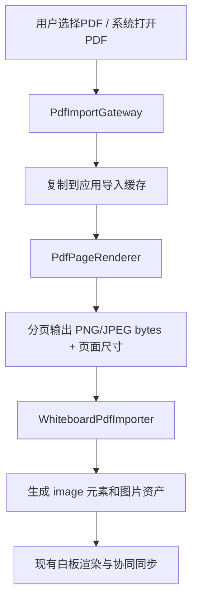

# PDF上传打开到应用的多端实现方案调研

## 实现落地记录（2026-07-08）

本次已按“平台文件入口 + PDF 页面转图片 + 白板图片元素”的主路线落地第一版应用内 PDF 导入：

- HarmonyOS 端使用 Flutter MethodChannel `flow_muse/pdf_import` 调 ArkTS，实现基于 `pdfService.PdfDocument` 的 PDF 页面转 PNG。
- Android、iOS、macOS、Windows、Web 使用 Flutter `pdfx` 渲染 PDF 页面。
- Linux、Fuchsia 暂时显式标记为不支持，避免静默失败。
- `pdfrx_engine` / `pdfium_dart` 曾作为候选验证，但在 OHOS 构建中触发 native-assets hook 错误 `Unsupported PDFium platform: ohos`，因此未采用。
- 白板数据层仍复用现有 `ImageElement` 和 `ImageFile`，没有新增 PDF 专用协同协议字段。

## 背景

FlowMuse 当前白板已接入 `MarkdrawEditor`，已有 `.markdraw`、`.excalidraw`、图片导入、PNG/SVG 导出等文件能力。现有文件入口集中在 `MarkdrawFileHandler`，通过 `file_picker` 调起系统文件选择器；图片导入最终进入 `controller.importImage(...)`。项目还没有 PDF 作为白板内容的公共模型，也没有 PDF 文件被系统“打开方式”拉起后的处理链路。

当前 `FlowMuse-App/pubspec.yaml` 已依赖 `file_picker: ^8.0.0`。鸿蒙 `ohos/entry/src/main/module.json5` 只声明了首页入口 `action.system.home`，尚未声明 PDF 文件打开能力。Android `AndroidManifest.xml` 当前存在用户已有未提交改动，本次调研未修改。

## 目标边界

- 支持用户在应用内选择 PDF 并导入白板。
- 支持从系统文件管理器或其他应用选择“用 FlowMuse 打开 PDF”。
- 多端优先：HarmonyOS、Android、iOS、Windows、macOS、Linux、Web 尽量共享白板层数据表达。
- PDF 导入后的核心体验应是“PDF 页面可作为白板背景/图片层显示，并能继续手写批注”，不是只做独立 PDF 阅读器。
- 第一阶段不要求编辑 PDF 原文件内的注释、表单、书签，也不要求把白板批注反写回 PDF。

## 结论

推荐采用“平台文件入口 + PDF 页面转图片 + 白板图片元素”的路线。

公共 Flutter 层负责统一的 PDF 导入流程、导入进度、页面布局和白板元素生成；各平台只负责拿到 PDF 字节或可读临时文件，并把页面渲染为图片。HarmonyOS 端优先用 ArkTS `PDF Kit` 通过平台通道完成 PDF 页面转图片；非鸿蒙端优先选 `pdfrx` 或 `pdfx` 这类成熟 Flutter PDFium/渲染插件。最终把每页 PDF 渲染成 PNG/JPEG 图片，复用现有图片元素与协同同步链路。

这条路线对协同白板最稳：协同同步仍同步普通白板元素和图片资产，不把 PDF 阅读器状态、原生 PdfView 状态或平台专属对象塞进协同协议。缺点是导入大 PDF 时需要分页渲染、缓存和内存控制。

## 方案对比

| 方案 | 做法 | 优点 | 风险 | 适配结论 |
| --- | --- | --- | --- | --- |
| A. PDF页转图片后导入白板 | 选择/接收 PDF，按页渲染为图片，生成白板 image 元素 | 多端一致；易协同；与现有白板图片能力兼容；可离线 | 大文件耗时和占空间；文本不可选；放大清晰度取决于渲染倍率 | 推荐作为 MVP 和主线 |
| B. 嵌入原生/Flutter PDF Viewer | 使用 Harmony `PdfView`、Syncfusion 或 pdfrx Viewer 直接显示 PDF | 阅读体验完整，有搜索/缩放/页码 | 难和白板手写、缩放、协同统一；鸿蒙原生 View 嵌入 Flutter 成本高 | 适合作为只读预览，不适合作为白板底层 |
| C. 后端转换 PDF | 上传 PDF 到服务器，用 Poppler/MuPDF/PDFium 转图片，客户端下载页图 | 所有客户端一致；弱设备压力小；可做 OCR/缩略图 | 依赖网络；隐私和文件传输成本；后端部署复杂 | 可作为协同/大文件增强，不作为离线优先 MVP |
| D. Web/PDF.js | Flutter Web 或 ArkWeb 加载 PDF.js/PDF 预览 | 跨端技术统一；生态成熟 | 移动端性能和内存不稳定；与白板元素/手写融合复杂 | 可用于 Web 端预览或兜底，不推荐主线 |

## HarmonyOS 关键技术点

### 1. 文件选择：DocumentViewPicker

本地资料 `harmonyos-guides/应用框架/Core File Kit（文件基础服务）/用户文件/选择与保存用户文件/select-user-file.md` 指出：

- `DocumentViewPicker` 用于选择文档类文件。
- 可通过 `fileSuffixFilters` 过滤 `.pdf`。
- Picker 返回的是文档类 URI，默认临时读写授权，应用退到后台后临时权限会失效。
- 拿到 URI 后可用 `fileIo.openSync(uri, fileIo.OpenMode.READ_ONLY)` 获取 fd，再读取内容。

对本项目的含义：

- 如果 Flutter `file_picker` 在鸿蒙端能力不足，应写一个小型 ArkTS 平台通道，暴露 `pickPdf()` 给 Dart。
- 选择后建议立即复制 PDF 到应用沙箱或导入缓存目录，再开始转图片，避免临时授权失效。

### 2. 从系统“打开方式”接收 PDF：Want + module.json5 skills

本地资料 `file-processing-apps-startup.md` 和 `module-configuration-file.md` 给出的目标方接入要点：

- 在 `module.json5` 的 `abilities.skills` 中声明 `ohos.want.action.viewData`。
- `uris.scheme` 使用 `file`。
- `uris.type` 可使用 UTD 或 MIME。PDF 在 UTD 列表中是 `com.adobe.pdf`，MIME 是 `application/pdf`。
- `linkFeature` 用于声明文件打开能力，例如 `FileOpen`。
- 被拉起后，在 `EntryAbility.onCreate(want, launchParam)` 中读取 `want.uri`，用 `fileIo.openSync` 打开。

建议配置方向：

```json5
{
  "actions": ["ohos.want.action.viewData"],
  "uris": [
    {
      "scheme": "file",
      "type": "com.adobe.pdf",
      "linkFeature": "FileOpen"
    },
    {
      "scheme": "file",
      "type": "application/pdf",
      "linkFeature": "FileOpen"
    }
  ]
}
```

实际实现时还要处理应用已运行时的新 Want，例如 `onNewWant` 或 FlutterAbility 对应生命周期能力，避免冷启动能打开、热启动不能打开。

### 3. PDF渲染：PDF Kit

本地 `PDF Kit` 文档显示：

- `PDF Kit` 包含 `pdfService` 和 `PdfView`。
- `PdfView` 适合预览、搜索、批注、页面跳转、缩放。
- `pdfService` 适合加载/保存 PDF、页面操作、水印、背景、书签、PDF 转图片等文档处理。
- `PdfView` 也有 `getPagePixelMap(pageIndex)`，可将页面缩略图转成 `image.PixelMap`。
- `PDF Kit` 当前只支持中国境内（不含港澳台），设备支持 Phone、Tablet、PC/2in1、Car，模拟器支持 ARM、不支持 x86。

对本项目的含义：

- HarmonyOS 端主线应优先用 `pdfService` 或 `PdfController.getPagePixelMap` 转页面图，再通过平台通道把 PNG/JPEG bytes 返回 Dart。
- 不建议把 `PdfView` 直接嵌入 Flutter 白板作为可书写背景，因为这会引入原生视图嵌入、手势路由、缩放同步和协同状态同步问题。
- 需要在平台通道中控制渲染倍率，例如按目标白板宽度或 2x/3x 设备像素比输出，避免放大后模糊。

### 4. ArkWeb PDF预览兜底

本地 `ArkWeb/web-pdf-preview.md` 指出，Web 组件支持预览 PDF，可加载网络 PDF、应用沙箱内 PDF 和 rawfile PDF；但官方文档明确提示受限于性能，部分场景存在掉帧，如对流畅度有要求建议使用 `PdfView` 或 PDF.js。

对本项目的含义：

- ArkWeb 可作为“只读预览 PDF”的兜底，不适合作为协同白板导入主线。
- 如果以后需要 Web 端统一预览，可以复用 PDF.js，但仍建议导入白板时走页转图片。

## 非鸿蒙端成熟方案

### Flutter公共选择文件

`file_picker` 是成熟方案，pub.dev 描述其支持使用原生文件浏览器选择单个/多个文件并按扩展名过滤。当前项目已使用它。导入 PDF 可在非鸿蒙端先用：

```dart
FilePicker.platform.pickFiles(
  type: FileType.custom,
  allowedExtensions: ['pdf'],
  withData: true,
)
```

注意：Web 端通常依赖 `bytes`；移动/桌面端可以优先用 path，但为统一管线，导入阶段最好抽象成 `PdfInput { name, bytes/path, sourceUri }`。

### PDF渲染插件候选

| 插件 | 平台 | 能力 | 适用性 |
| --- | --- | --- | --- |
| `pdfrx` | pub.dev 显示支持 Android、iOS、Windows、macOS、Linux、Web | 基于 PDFium，支持查看、渲染和部分 PDF 操作 | 多端覆盖最好，适合作为非鸿蒙主候选 |
| `pdfx` | pub.dev 显示支持 Web、macOS、Android、iOS、Windows，提供 renderer 和 viewer API | 可把 PDF 页面渲染为图片，也提供 Viewer | 适合页面转图片；Linux 支持需再实测 |
| `syncfusion_flutter_pdfviewer` | 官方称支持 Android、iOS、Web、Windows、macOS、Linux | 完整 Viewer、搜索、选择、表单等 | 阅读器强，但许可证和白板融合成本需评估 |
| `syncfusion_flutter_pdf` | Dart PDF 创建/读取/编辑库，支持 Android、iOS、Web | 更偏 PDF 创建/编辑，不是白板页渲染主力 | 可用于后续导出/生成 PDF |

推荐先技术 Spike `pdfrx` 和 `pdfx` 的“从 bytes/path 渲染指定页为图片”的 API。若只做阅读器，Syncfusion Viewer 更省事；但本项目是白板，优先看渲染页图的稳定性、内存占用和授权条件。

## 多端“用本应用打开PDF”入口

| 平台 | 系统入口 | 技术点 | Flutter侧处理 |
| --- | --- | --- | --- |
| HarmonyOS | `module.json5` skills + `ohos.want.action.viewData` | `scheme: file`，`type: com.adobe.pdf/application/pdf`，`EntryAbility` 读取 `want.uri` | ArkTS 平台通道发送 `openedPdf` 事件或提供 `getInitialPdf()` |
| Android | `AndroidManifest.xml` intent-filter | `ACTION_VIEW`、`CATEGORY_DEFAULT`、`data android:mimeType="application/pdf"`，读取 `content://` 时用 ContentResolver | 可用接收 intent 插件或自定义 Kotlin channel |
| iOS/iPadOS | `Info.plist` 文档类型/UTType | `CFBundleDocumentTypes`、`LSItemContentTypes` 包含 `com.adobe.pdf`；必要时使用 document picker/share extension | AppDelegate/SceneDelegate 收到 URL 后转给 Dart |
| Desktop | 文件关联或打开文件参数 | Windows 注册文件关联、macOS document types、Linux desktop MIME | 启动参数/平台通道转为导入请求 |
| Web | `<input type=file accept=application/pdf>` | 浏览器文件选择，无系统“默认打开” | `file_picker` Web bytes 或自定义 input |

跨端抽象建议统一成：

```dart
abstract interface class PdfImportGateway {
  Future<PdfImportSource?> pickPdf();
  Stream<PdfImportSource> get openedPdfs;
  Future<List<PdfRenderedPage>> renderPages(PdfImportSource source, PdfRenderOptions options);
}
```

鸿蒙实现走 ArkTS；非鸿蒙实现走 Flutter 插件；Web 实现走 bytes 渲染或服务端兜底。

## 推荐架构



### 数据表达

第一阶段不要新增 PDF 专用白板元素，建议复用现有图片元素：

- 每页 PDF 对应一个 image element。
- 图片文件进入现有图片资产存储。
- 页面按纵向排列，间距固定，例如 24 logical px。
- 记录导入来源元数据可放在元素 custom data 或后续文档级 metadata，但不要阻塞 MVP。

如果后续需要“重新渲染更高清页面”或“保留原 PDF”，再新增：

- `PdfDocumentAsset`：原始 PDF bytes、sha256、pageCount。
- `PdfPageImageElement`：指向 PDF asset + pageIndex + renderedImageId。

第一阶段先不这样做，避免同步协议和存储格式膨胀。

### 渲染策略

- 默认按页面宽度 1440-2048 px 渲染，兼顾手写批注清晰度和内存。
- 大 PDF 分批渲染，先渲染前 1-3 页并插入，再后台继续。
- 单页渲染失败时跳过该页并给出导入报告，不应让整个导入失败。
- 加密 PDF：先检测并提示“不支持加密 PDF”或后续加密码输入。
- 超大 PDF：设软限制，例如超过 100 页提示用户确认。

### 存储与协同

- 协同同步层继续同步白板元素和图片资产，接收端无需安装 PDF 插件即可显示。
- 原 PDF 是否上传到后端是增强项，不影响第一阶段多人显示。
- 图片资产建议按 hash 去重，避免同一 PDF 多次导入造成重复上传。

## 阶段建议

### Stage 1：应用内选择 PDF 并导入为图片页

- 非鸿蒙端用 `file_picker` 选 `.pdf`。
- 鸿蒙端若现有 `file_picker` 可用则先复用；不可用则写 ArkTS `DocumentViewPicker` 平台通道。
- 先选 `pdfrx` 或 `pdfx` 做非鸿蒙页面渲染 Spike。
- 鸿蒙端写 `PdfKitPageRenderer` 平台通道，返回 PNG/JPEG bytes。
- 生成白板图片元素，验证协同端可显示。

### Stage 2：系统打开 PDF 进入应用

- HarmonyOS：补 `module.json5` skills，`EntryAbility` 读取 `want.uri`，复制文件到沙箱，通过 channel 交给 Dart。
- Android：补 `ACTION_VIEW` intent-filter 和 `content://` 读取。
- iOS：补 `CFBundleDocumentTypes` / UTType。
- 桌面端：按平台文件关联逐步补齐。

### Stage 3：体验优化

- 导入进度、取消、页数限制、错误报告。
- 缩略图预览和选择导入页范围。
- 更高质量重渲染、懒加载页图。
- 可选后端转换作为大文件/弱设备兜底。

## 风险与待验证点

- HarmonyOS `PDF Kit` 有地区限制，海外或港澳台设备不可作为唯一方案。
- HarmonyOS `PDF Kit` 在 Flutter 项目中需要 ArkTS 平台通道，需验证 FlutterAbility 生命周期和 MethodChannel/EventChannel 的接法。
- `file_picker` 当前版本不一定覆盖 OHOS；pub.dev 上存在 `file_picker_ohos`，但需要实测与当前 Flutter OHOS 工具链兼容性。
- `pdfrx`、`pdfx` 对 Web、桌面、大 PDF 的内存表现需要用真实讲义/论文 PDF 验证。
- PDF 页面转图片会失去文本选择和矢量无限缩放能力，但对白板批注和协同最稳。

## 参考来源

- 本地 `harmonyos-guides/应用服务/PDF Kit（PDF服务）/pdf-introduction.md`
- 本地 `harmonyos-guides/应用服务/PDF Kit（PDF服务）/PdfView预览组件/pdf-pdfview-component.md`
- 本地 `harmonyos-guides/应用服务/PDF Kit（PDF服务）/PdfView预览组件/pdf-pdfview-open.md`
- 本地 `harmonyos-guides/应用服务/PDF Kit（PDF服务）/PdfView预览组件/pdf-pdfview-page2img.md`
- 本地 `harmonyos-guides/应用框架/ArkWeb（方舟Web）/处理网页内容/web-pdf-preview.md`
- 本地 `harmonyos-guides/应用框架/Core File Kit（文件基础服务）/用户文件/user-file-uri-intro.md`
- 本地 `harmonyos-guides/应用框架/Core File Kit（文件基础服务）/用户文件/选择与保存用户文件/select-user-file.md`
- 本地 `harmonyos-guides/应用框架/Ability Kit（程序框架服务）/应用间跳转/拉起指定类型的应用/file-processing-apps-startup.md`
- 本地 `harmonyos-guides/基础入门/开发基础知识/应用配置文件/module-configuration-file.md`
- 本地 `harmonyos-guides/应用框架/ArkData（方舟数据管理）/标准化数据定义/uniform-data-type-list.md`
- Flutter 官方平台通道文档：<https://docs.flutter.dev/platform-integration/platform-channels>
- `file_picker`：<https://pub.dev/packages/file_picker>
- `file_picker_ohos`：<https://pub.dev/packages/file_picker_ohos>
- `pdfrx`：<https://pub.dev/packages/pdfrx>
- `pdfx`：<https://pub.dev/packages/pdfx>
- Syncfusion Flutter PDF Viewer：<https://www.syncfusion.com/pdf-viewer-sdk/flutter-pdf-viewer>
- Apple `CFBundleDocumentTypes`：<https://developer.apple.com/documentation/bundleresources/information-property-list/cfbundledocumenttypes>
- Android `Intent`：<https://developer.android.com/reference/android/content/Intent>
