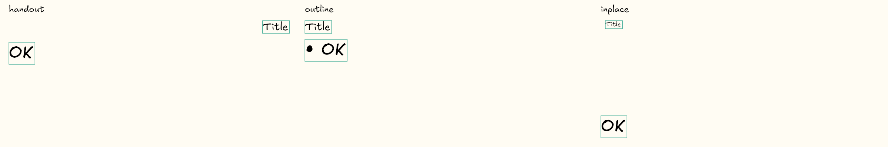

# Issue #14：旧版智能排版文本框紧包裹

## 范围与原因

从 `origin/main`（`6702677`）新建独立修复分支。用户本次明确要求修复旧版智能排版的文本框尺寸；不混入 V3 整页理解分支，不改识别引擎、字号估算、模型调用或手写笔交互。

识别产物先继承笔迹包围盒，创建、模板改字号/加项目符号、草稿校对又使用 `max(旧尺寸, 测量尺寸)`，导致框只能变大，正文缩字号也无法回收排版空间。

## 实现

1. 在既有 `SmartLayoutTemplateEngine` 复用 `TextRenderer.measure`，让上述入口共用尺寸规则：仅自动生成且仍允许自动尺寸的普通横排文本，宽取 `max(测量宽 + 4, 20)`、高取 `max(测量高, 字号 × 行高)`。
2. 用现有 `flowMuse.smartLayout` / `blockId` 与 `autoResize` 标记限定范围，不新增持久化字段；手动框、绑定文本、公式、竖排维持既有规则。
3. 原文整理继续按源笔迹中心落位；其余模板按新实测框排布，校对保持左上角不动。保留手写模式、原生文本及一次提交/撤销语义不变。

## 验证

- 增加常驻回归测试：实际旧版准备入口到三模板，标题/正文紧框、压缩后重新测量、校对长短文字、提交及撤销、例外元素。
- 先在旧实现复现失败，再验证修复；运行相关测试、全量 `flutter test --no-pub` 和 `flutter analyze --no-pub`。
- 记录修复前失败值，并用固定识别响应和实际文本渲染生成三模板效果图；这是桌面自动化视觉证据，不冒充平板实机或识别精度验证。
- 仅改共享 Dart 逻辑，无平台分支、依赖、数据库或协议变更。验证完成后提交 PR，按用户要求关闭 #14；本任务不合并、不部署。

## 完成证据（2026-09-20）

- 修复前新回归 2 项失败：标题实测所需宽约 `46.27`，实际框宽 `600`；讲义缩字号后仍被旧框高 `180` 拦截，无法放入高 `40` 的内容区。
- 修复后新增 4 项通过；旧版视觉管线/三模板/草稿/repro、#9 转文字和 V3 隔离/测量/物化的专项回归共 **116 项通过**。
- 全量测试 **1692 项通过，1 项跳过**（原有 `SMART_LAYOUT_RENDER_BENCH` 可选渲染基准）；`flutter analyze --no-pub` 零问题。
- 下图使用仓库捆绑字体、固定识别响应，经实际旧版控制器及三模板生成。绿色线为元素真实边界，各列仅平移到画面内，未改变字号或框尺寸。未进行平板实机验证。



复现命令（工作目录 `FlowMuse-App`）：

```sh
flutter test --no-pub --reporter expanded --dart-define=ISSUE14_CAPTURE=build/issue-14-after.png test/features/whiteboard/editor_core/smart_layout_text_box_sizing_test.dart
flutter test --no-pub --reporter expanded --dart-define=ISSUE14_CAPTURE=build/issue-14-after.png
flutter analyze --no-pub
```
