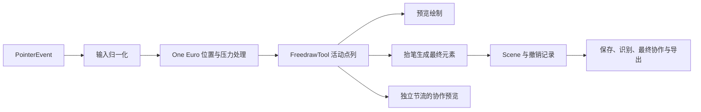

# 自由绘画与书写体验优化方案

日期：2026-09-21。分析基线：`main@d9ab1927ac496bde255288783afb739ef32948d5`。

本轮为调研、源码分析和验证，不修改应用实现、笔刷参数或功能开关。重点是自由笔画，覆盖手写笔、手指和鼠标，以及笔画提交、历史记录、保存、识别、协作与导出之间的关系。共享编辑器涉及六个平台；鸿蒙与 Android 平板应优先提供真机证据。

**推荐顺序：补齐验收基线 → 修复可见反馈缺陷、消除无效工作 → 收紧重绘范围 → 优化经测量确认的长笔热点 → 改善笔刷选择与预览 → 最后才评估输入调参与预测。**

“不影响效果、流畅度、实时性”不能在没有目标设备实测时被绝对证明。本方案把它落实为发布硬门禁：已有正常笔迹和持久化语义不变；任何候选项只在独立回归、同机性能对照和手感验收通过后启用；结果不确定时保留原路径。不会把“画质更好但慢了 15%”认定为满足本次需求。

**一、成熟产品和平台公开资料给出的依据**

下表区分公开产品行为与公开实现。Goodnotes、Procreate 的私有引擎没有在这些资料中公开，不能据此声称知道其内部线程、缓存或具体滤波实现。

| 参考 | 公开可确认的做法 | 对 FlowMuse 的启示 |
| --- | --- | --- |
| Goodnotes | 区分恒宽圆珠笔、压感钢笔和高压感毛笔；笔尖、压感、稳定度可调；提供常用笔画与颜色预设。[官方说明](https://support.goodnotes.com/hc/en-us/articles/7353756785679-Write-and-customize-ink-with-the-Pen-tool) | 保留不同笔的用途，通过真实笔迹预览帮助选择。不能把五种笔统一加强平滑或压感。 |
| Procreate | 将路径稳定与压力稳定分开；可按笔刷设置；降低稳定度能保留更自然的线条，降低压力平滑能让提按更快响应。[官方手册](https://help.procreate.com/procreate/handbook/brushes/brush-studio-settings) | 手感需要可控的响应，不是平滑越强越好。优先保留现有默认手感，再提供独立可选方案。 |
| Krita | 无平滑适合快速响应和细节；Stabilizer 会使笔迹落后于光标；分别配置快、慢速度下的稳定程度。[官方手册](https://docs.krita.org/en/reference_manual/tools/freehand_brush.html) | 写小字、急转折和快速连笔时，重稳定会损失跟手性。不能用额外等待窗口换取平滑。 |
| Apple UIKit | 可获取事件中合并的高频真实采样；预测点只用于临时显示，新真实事件到来后必须丢弃预测。[真实采样](https://developer.apple.com/documentation/uikit/getting-high-fidelity-input-with-coalesced-touches)、[预测采样](https://developer.apple.com/documentation/uikit/minimizing-latency-with-predicted-touches) | 先确认平台实际向 Flutter 交付了哪些真实样本。预测与真实笔迹必须彻底分开，不能进入文件、撤销或识别。 |
| Android Ink / stylus API | 官方 Ink 建于低延迟图形能力之上；front buffer 适合局部笔迹更新；官方建议降低输入事件处理中的分配成本。[Ink](https://developer.android.com/develop/ui/compose/touch-input/stylus-input/about-ink-api)、[输入与低延迟图形](https://developer.android.com/develop/ui/views/touch-and-input/stylus-input/advanced-stylus-features) | 借鉴活动笔迹与已确认内容分离、减少热路径工作。原生 front buffer 不是 Flutter 中增加一个 CustomPaint 就能获得的能力，也不能直接迁移到鸿蒙。 |
| perfect-freehand | 根据点列生成轮廓，区分真实与模拟压力，可调整 smoothing、streamline、taper。[官方仓库](https://github.com/steveruizok/perfect-freehand) | 项目已经使用 Dart 移植版，不需要替换库来获得这些能力。更应该检查调用频率、输入质量和轮廓是否被重复计算。 |
| HarmonyOS Pen Kit | 提供独立 PointPredictor，以及更完整的手写套件；公开预测入口需要原生 TouchEvent。[报点预测](https://developer.huawei.com/consumer/cn/doc/harmonyos-guides/pen-point-prediction) | 可作为后期平台适配试验。现有 Flutter 指针事件并不自动满足其原生入口条件，不能只加一条每点 MethodChannel 调用就假定能降低延迟。 |

鸿蒙依据还核对了本地官方文档镜像：[接入报点预测](<D:/Program/HarmonyOS/harmonyos-guides/系统/硬件/Pen Kit（手写笔服务）/手写功能开发/pen-point-prediction.md>)。当前工程可见的 Pen Kit channel 主要是取色，不能据此认定已经接入原生低延迟书写。

**二、项目实际链路与已有基础**



应保留并复用的基础：

- `StrokeInputModeler` 已有屏幕逻辑坐标下的滤波、转角保护、压力处理和真实终点 flush。不是缺少平滑算法。
- `FreedrawTool` 的活动点列采用可增长列表与只读视图，move 不主动生成完整持久化元素。不要重新引入逐点复制完整笔画。
- `BrushRenderProfile` 是笔形参数真源；压力灵敏度在创建时编码；笔形和灵敏度在落笔时冻结。不要恢复全局参数重解释历史笔迹的做法。
- 铅笔与毛笔的新真实压感笔迹已有自然介质 v2；圆珠笔、钢笔、荧光笔继续使用 classic。已有 `brushRenderVersion` 和确定性种子，不需要再建一套笔刷引擎。
- 自然介质已存在静态 `ui.Picture` 缓存，远端湿墨也已有冻结块和尾段机制。不能把“新增所有缓存”写成从零建设任务。
- 本地湿墨与协作 live ink V2 已有实现，但源码构建默认值均为 `false`。本轮没有读取用户设备上安装包的编译参数，因此不把源码默认值冒充所有已安装包的状态。
- 保存已做 debounce，协作预览已有 50ms 节流，不能简单描述为“每个 move 都同步写数据库/发送整场景”。
- 最近 `3766a2f` 已修复 V3 排版监听释放与重复整页指纹计算。此项应做回归保护，不再作为尚未实现的优化。

主要入口：[Controller](D:/Program/HarmonyOS/2024-se-17/FlowMuse-App/lib/features/whiteboard/editor_core/src/ui/markdraw_controller.dart:2184)、[FreedrawTool](D:/Program/HarmonyOS/2024-se-17/FlowMuse-App/lib/features/whiteboard/editor_core/src/editor/tools/freedraw_tool.dart:52)、[笔刷参数](D:/Program/HarmonyOS/2024-se-17/FlowMuse-App/lib/features/whiteboard/editor_core/src/core/elements/brush_render_profile.dart:27)。

**三、当前问题与可改进点**

证据分级：A = 本轮已复现；B = 源码明确存在，但影响幅度需要测量；C = 合理候选，尚不能认定为瓶颈。

| 编号 | 等级 | 发现与影响 | 代码依据 |
| --- | --- | --- | --- |
| F1 | B | 默认路径每个被接受的 move 调用 Controller.notifyListeners，编辑器监听后 setState；静态 painter 同时包含活动预览。笔迹变化会带动与笔尖无关的构建及绘制工作。 | [通知分支](D:/Program/HarmonyOS/2024-se-17/FlowMuse-App/lib/features/whiteboard/editor_core/src/ui/markdraw_controller.dart:2405)、[编辑器监听](D:/Program/HarmonyOS/2024-se-17/FlowMuse-App/lib/features/whiteboard/editor_core/src/ui/markdraw_editor.dart:428)、[默认开关](D:/Program/HarmonyOS/2024-se-17/FlowMuse-App/lib/features/whiteboard/editor_core/src/config/writing_feature_flags.dart:6) |
| F2 | A | 开启本地湿墨后虽然减少了 Controller 通知，但静态和湿墨 CustomPaint 是父子关系，缺少两者之间的独立重绘边界。本轮仅更新活动圆珠笔时，背景中静态铅笔在 down、move 各被重放一次。 | [画层创建](D:/Program/HarmonyOS/2024-se-17/FlowMuse-App/lib/features/whiteboard/editor_core/src/ui/editor_canvas.dart:335)、[静态 painter 的 child](D:/Program/HarmonyOS/2024-se-17/FlowMuse-App/lib/features/whiteboard/editor_core/src/ui/editor_canvas.dart:510) |
| F3 | B | 默认预览要求至少两个点。down 本身的 ToolResult 为 null，不能依赖 applyResult 触发默认预览。轻点、落笔等待、很慢的首段可能先无墨，再突然出现。 | [预览门限](D:/Program/HarmonyOS/2024-se-17/FlowMuse-App/lib/features/whiteboard/editor_core/src/ui/markdraw_controller.dart:3088)、[null result](D:/Program/HarmonyOS/2024-se-17/FlowMuse-App/lib/features/whiteboard/editor_core/src/ui/markdraw_controller.dart:1115) |
| F4 | A | 铅笔 v2 的单点及两个完全重合点渲染为 0 个非透明像素；同环境短线为 303 像素、毛笔点为 90 像素。采样器的退化点发成 brushTeardrop，但铅笔 renderer 依赖 samples 基底与 pencilGrain，没有消费这个点。句号、点画、轻点标记属于实际缺陷。 | [退化点](D:/Program/HarmonyOS/2024-se-17/FlowMuse-App/lib/features/whiteboard/editor_core/src/rendering/natural_media/natural_media_stroke_sampler.dart:278)、[铅笔基底](D:/Program/HarmonyOS/2024-se-17/FlowMuse-App/lib/features/whiteboard/editor_core/src/rendering/natural_media/pencil_stroke_renderer_v2.dart:139) |
| F5 | A/B | minDistance 判定早于压力输出；原地从 0.2 加压到 0.8、间隔 16ms 的事件被丢弃。慢起笔的压力变化因此可能未及时呈现。超过 200ms 的间隔又会走另一分支，表现并非永久冻结；实际可感知程度需真机确认。 | [距离门限](D:/Program/HarmonyOS/2024-se-17/FlowMuse-App/lib/features/whiteboard/editor_core/src/input/stroke_input_modeler.dart:166)、[设备参数](D:/Program/HarmonyOS/2024-se-17/FlowMuse-App/lib/features/whiteboard/editor_core/src/input/input_policy.dart:39) |
| F6 | B | 本地活动笔迹每次 paint 仍整笔处理。classic 重做 PointVector/getStroke/Path；v2 重做绝对点列、采样和几何。路径随笔增长；按固定报点率持续绘制时，累计工作可能呈近似二次增长。尚无当前真机数据证明何时达到掉帧阈值。 | [本地湿墨](D:/Program/HarmonyOS/2024-se-17/FlowMuse-App/lib/features/whiteboard/editor_core/src/rendering/local_wet_ink_painter.dart:65)、[classic 轮廓](D:/Program/HarmonyOS/2024-se-17/FlowMuse-App/lib/features/whiteboard/editor_core/src/rendering/rough/freedraw_renderer.dart:55)、[v2 铅笔](D:/Program/HarmonyOS/2024-se-17/FlowMuse-App/lib/features/whiteboard/editor_core/src/rendering/natural_media/pencil_stroke_renderer_v2.dart:41) |
| F7 | B | v2 的 sampleCap/particleCap 是生成候选之后才裁减，限制的是结果数量，不是生成过程的峰值成本。铅笔超过 cap 时按整笔数量重选颗粒，追加点可能改变前段保留集合，存在纹理闪动风险；本轮只确认算法，未伪称已看到真机闪动。 | [samples 后置限额](D:/Program/HarmonyOS/2024-se-17/FlowMuse-App/lib/features/whiteboard/editor_core/src/rendering/natural_media/natural_media_stroke_sampler.dart:222)、[颗粒生成与限额](D:/Program/HarmonyOS/2024-se-17/FlowMuse-App/lib/features/whiteboard/editor_core/src/rendering/natural_media/natural_media_stroke_sampler.dart:451) |
| F8 | B | 自然介质静态缓存命中前，铅笔和毛笔仍先生成绝对坐标列表；这是可以移到 miss 分支的无效分配。静态重绘还会重新复制/排序 Scene，部分绑定查询为线性扫描。后一项应测量后再加派生缓存。 | [铅笔查缓存前分配](D:/Program/HarmonyOS/2024-se-17/FlowMuse-App/lib/features/whiteboard/editor_core/src/rendering/natural_media/pencil_stroke_renderer_v2.dart:41)、[毛笔](D:/Program/HarmonyOS/2024-se-17/FlowMuse-App/lib/features/whiteboard/editor_core/src/rendering/natural_media/brush_pen_stroke_renderer_v2.dart:42)、[Scene 排序](D:/Program/HarmonyOS/2024-se-17/FlowMuse-App/lib/features/whiteboard/editor_core/src/core/scene/scene.dart:35) |
| F9 | B | 每次 presence 回调先 _markUserActive，再做网络节流；它取消并重建两个分钟级 Timer。离线时回调也接线，检查房间发生得更晚。自动保存中仍有同步场景序列化及后续封面更新，可能在下一笔期间执行，需单独测量。 | [presence](D:/Program/HarmonyOS/2024-se-17/FlowMuse-App/lib/features/whiteboard/views/whiteboard_page.dart:3089)、[Timer](D:/Program/HarmonyOS/2024-se-17/FlowMuse-App/lib/features/whiteboard/views/whiteboard_page.dart:3162)、[草稿 flush](D:/Program/HarmonyOS/2024-se-17/FlowMuse-App/lib/features/whiteboard/views/whiteboard_page.dart:469) |
| F10 | B | 笔刷面板主要展示图标和压力滑块，没有使用实际 renderer 的试写预览。用户不容易在切换前判断当前颜色、粗细、浓淡与端帽；这可以在设置交互内改善，无需增加画布每帧成本。 | [笔刷面板](D:/Program/HarmonyOS/2024-se-17/FlowMuse-App/lib/features/whiteboard/editor_core/src/ui/toolbar_palette_buttons.dart:174) |

F2 同时符合 Flutter 官方机制：共享 Layer 的子节点脏绘制会传播；`shouldRepaint=false` 不等于永不重绘。[RepaintBoundary 文档](https://api.flutter.dev/flutter/widgets/RepaintBoundary-class.html)

**最需要避免的误判：**

- “开关已经实现，所以打开即完成性能优化”——F2 已复现反例。
- “限制了 4096 个颗粒，所以每帧工作有相同上限”——F7 的候选先生成。
- “单元测试通过，所以首点必然可见”——F4 的像素复现否定这一点。
- “已有五笔视觉矩阵就是当前新笔全覆盖”——现有 `brush_visual_matrix_test.dart` 构造 customData 时未显式写新笔渲染版本，该矩阵不能替代当前铅笔/毛笔 v2 验收。

**四、测量设施仍有的盲区**

现有基建可以继续用，但不能原样承担本次全部承诺：

1. [书写 runner](D:/Program/HarmonyOS/2024-se-17/FlowMuse-App/integration_test/whiteboard_writing_perf_test.dart:43) 挂载 MarkdrawEditor，隐藏工具栏，没有挂载真实 WhiteboardPage 的保存、presence、页面监听等完整链路。
2. runner 未逐笔刷选择当前五笔；场景 fixture 中的自由笔画缺少 v2 元数据，图片是 placeholder。应新增真实压感的铅笔/毛笔、解码图片和 PDF 背景场景，不能只用旧混合场景证明新笔性能。
3. [ActivePreviewMetricsProbe](D:/Program/HarmonyOS/2024-se-17/FlowMuse-App/lib/features/whiteboard/editor_core/src/input/active_preview_metrics_probe.dart:114) 从 accepted 时刻记录，是 accepted-to-paint 代理指标。它不包含接受之前的过滤耗时和等第二点的等待，更不等于屏幕像素已经亮起。
4. 旧 [P0 基线](D:/Program/HarmonyOS/2024-se-17/docs/研发记录/research/writing-performance-p0-baseline.md) 与 [P1 门禁](D:/Program/HarmonyOS/2024-se-17/docs/研发记录/research/writing-performance-p1-gates.md) 仍标记 `deferred_device/not_evaluated`；本轮没有找到该默认 raw 目录下的有效当前基线。别处可能存在旧设备证据，不能由此推断项目从未测过真机。
5. 8 月自然笔刷方案存在允许一定性能退化的验收门槛。它服务于当时的画质改造，本轮明确不沿用其退化额度，也不覆盖或改写旧记录。

**五、实施方案与顺序**

以下工期为单人有效工作量估算，不含设备排队和跨端返工；每一行独立提交、验证和回退。

| 阶段 | 内容 | 预期收益 | 风险与启用条件 | 估算 |
| --- | --- | --- | --- | --- |
| S0 必做 | 冻结当前版本、当前笔形和测量口径，扩充真实五笔与整页 runner | 防止优化方向错误及假阳性 | 测试入口隔离，不增加发布版逐点日志；性能变化前完成 | 1.5–3 日 |
| S1a 优先 | 修复铅笔零长点、首点即时反馈 | 点画可见，落笔更及时 | 单独列出修复前后允许差异；正常线条像素不变，抬笔/取消不留残影 | 0.5–1.5 日 |
| S1b 优先 | 缓存命中前的坐标分配后移；presence Timer 去除逐点重建 | 减少 CPU/分配和 GC 压力 | 旧输出逐值一致；在线状态与生命周期不变 | 0.5–1 日 |
| S2 主线 | 复用本地湿墨 notifier，验证并收紧真实重绘范围 | 页面越复杂，越有机会改善连续书写 | 必须验证混合、层序、交接与真机性能；不直接翻默认开关 | 2–4 日 |
| S3a 条件 | 将候选采样/颗粒的无效对象生成移出热点，保留现有选择结果 | 铅笔长笔画及极端数据更稳定 | 先证明输出等价；不能单纯减颗粒换性能 | 1–3 日 |
| S3b 条件 | 当前本地笔画的已稳定前段复用与尾段更新 | 长划末段不持续变慢 | 仅长笔测量触发；分笔刷证明，不直接复制远端近似分段方案 | 3–6 日 |
| S3c 条件 | Scene 排序/查找派生缓存；保存与封面工作避让 | 大场景、连续短笔中的抖动减少 | 只对 profile 热点实施，不能降低保存可靠性 | 1–3 日 |
| S4 可选 | 实际笔刷试写预览、常用设置可见性、笔型切换反馈 | 提高美观度与可预期性 | 面板打开/参数改变时才渲染；绘画热路径无额外工作 | 1–2 日 |
| S5 后置 | 慢起笔压力策略、可选稳定度、原生采样/短时预测 | 有证据的特定设备跟手性或提按改善 | 输入与笔形会受影响，须独立 A/B；默认手感不变 | 按触发结果拆分 |

先完成 S0、S1、S2 的最小闭环，预计约 5–10 个有效工作日；条件项未触发则结束，不把所有候选优化预先做完。

**S0：把“不退化”变成能执行的门禁**

保留现有五类 recording、100/1000/5000 元素 fixture 和 Profile runner。补充测试场景，不重建一套框架。

- 增加五种笔刷显式参数，铅笔/毛笔同时测 classic 与新笔 v2；保留无压感回退。
- 增加完整白板宿主场景：离线、自动保存开、PDF 背景、刚退出智能排版、2 人/5 人协作。
- 使用合成或明确授权的回放数据。记录 Git SHA、dirty 状态、fixture hash、设备/系统/刷新率/DPR、构建 flags、实际后端与采样率；不采集用户真实白板正文到日志。
- 在当前探针旁分别记录：输入回调处理 CPU、接受前耗时、accepted-to-paint、down-to-first-visible、抬笔交接帧、UI/raster P95/P99、deadline miss、分配与峰值内存。
- `PointerEvent.timeStamp` 与本地 Stopwatch 不直接相减；端到端代理计时先统一时钟。真实 stylus-to-photon 仅来自高速录像或光电测量。
- 首点/终点的像素可见性单测独立于 probe；不能把“调用了 painter”作为“墨迹可见”的充分证据。

**S1a：先保证落笔有反馈**

1. 在共享自然介质采样/渲染规则中定义铅笔零长点，Canvas、SVG、本地/远端预览与 visual bounds 同口径，不在 UI 层画一颗和终稿不同的假圆点。
2. 使用真实 down 位置、当时压力与冻结笔形显示首点；不等待第二点、不增加预测点、不等网络或下一批采样。沿用 Flutter 正常帧调度，目标是下一可绘制帧可见，不承诺硬件零延迟。
3. 将“freedraw 可显示一个点”与 line/arrow 的两点条件分开，不能顺手让其他形状出现异常预览。
4. up 必须仍提交唯一笔画；cancel/切工具/页面切换后预览消失；从点变为短线时不双画、不突然换笔型。
5. 正常历史线条不变。零长铅笔由不可见变可见属于明确缺陷修复差异；若要求所有历史产物逐像素完全相同，连这项修复也应仅作用于新笔迹版本，不能静默重解释旧 v2。

验收重点：点按、停留、原地抬笔、两个重合点、0.6px 左右微小移动、标点、小汉字点画；压力 0/缺失/正常以及 mouse/touch 回退。

**S1b：先删除不改变结果的工作**

- 自然介质 renderer 先查现有缓存，miss 后才生成 `abs` 点列。该项不改变 key、几何和 draw 顺序；比较冷/热缓存像素一致，测量坐标分配次数。
- presence 离线时提前退出无意义的广播调度，但保留真正需要的本地活动状态。在线时记录 `lastActivity`，复用少量定时器按真实闲置截止时间重排，不随每个 pointer 重建两个计时器。
- 不把网络 50ms 节流套到本地输入，不降低真实点采样率，不延迟终笔提交来制造低 CPU 数据。

**S2：让笔尖变化只触发必要工作，特别保护荧光笔**

先复用 `LocalWetInkState` 和现有构建开关，消除默认路径的无关 widget 重建；再用 dry-paint 计数确认静态绘制有没有真的减少。二者必须分别验收。

这里不能机械地在各个 CustomPaint 外包 RepaintBoundary：荧光笔用 `BlendMode.darken`，依赖与底图、文字及既有笔迹的最终合成；新的隔离层可能改变结果。[Flutter 共享 Canvas 与混合说明](https://api.flutter.dev/flutter/rendering/CustomPainter-class.html)

按最小可用方案选择：

- 对普通 sourceOver 内容，可试验明确的重绘边界，保留“页面/静态内容 → 远端活动 → 本地活动 → 交互提示”的顺序。只有命中像素和物理性能门禁才使用。
- 对依赖底图混合的内容，优先保持同一 Canvas 的绘制关系；若静态 CPU 绘制是热点，可录制并重放单份已确认内容 `ui.Picture`，避免每帧遍历/排序/构造路径。它降低的是静态内容的 Dart 绘制成本，不保证 GPU 不再栅格化；如无净收益则保留旧路径。
- 不同时预建多套缓存或渲染后端。依据一轮实验选择最小方案；不可仅凭 paint 次数下降就宣告实时性提升。

缓存有效性至少覆盖当前 Scene 实例、viewport/尺寸、布局和裁剪、图片解码状态、主题/网格、编辑态、协作聚焦及本地高亮状态；退出/失效释放旧资源。不能只看 Scene 版本而忽略异步图片和视图状态。

抬笔交接要求：静态最终内容与活动预览在同一显示交接中完成；不能先清空预览再等待异步终稿，也不能让两者叠加一帧导致加深。保留现有同步 Scene 提交和一次 undo 语义。

**S3a / S3b：长笔画优化须先解决等价性**

现有远端缓存能提供分块、资源预算和边所有权参考，但本地复用不能直接照搬：

- classic 的 streamline、模拟压力、短笔行为和起收 taper 可能依赖此前状态或整笔长度；“缓存前 N 点、重算最后 64 点”不天然等价。
- v2 的颗粒 key 相对稳定，但达到整笔 particleCap 后的选择集合依赖总量；毛笔短线还存在从 teardrop 切到包络的阈值。必须先证明前段稳定，才允许永久冻结。
- 优先保留原选择算法，先计算保留索引/元信息、再创建实际需要的对象；噪声极值分支对 Set 反复使用 `elementAt`，可把该 Set 的现有迭代顺序物化一次后再按索引选择。注意它的插入顺序并非数值排序：不能直接换成已经排序的 `sortedKeep`，否则会改变保留颗粒。测试需要锁定输出集合，不能顺带改抽样结果。
- 若确实要改颗粒分配为只依赖局部边的稳定规则，这属于视觉算法变更，使用新的持久化渲染版本，并同步 Canvas、SVG、bounds 与协作版本白名单。仅增加缓存 `geometryVersion` 不能锁定历史文档外观。
- 已确认前段只缓存几何/绘制产物，最新尾段按最新真实点即时绘制；原始数据和终稿仍走同一事实源。必须给前段缓存设置资源预算、回收与缩放失效规则。
- 测试 63/64/65、127/128/129 点边界、cap 前后、自交/重叠、透明墨迹、短转长、快速反向、抬笔压力变化。不把远端现有的近似 mask 门槛直接当成本地“完全不变”。

触发条件：S2 后，同一 30 秒连续笔画后 10 秒的建模/构造/栅格耗时持续高于前 10 秒，且已影响既定帧预算或输入延迟；或 profile 证明候选分配是主要开销。未触发就保留整笔实现。

**S3c：保存和大场景的辅助工作不能抢下一笔**

- `Scene.orderedElements` 的按 Scene 实例派生缓存可复用不可变结构；所有调用者及排序 tie 行为核实后再做。不要先上四叉树或新的状态数据库。
- 保存、识别和最终协作目前已经主要位于提交之后；审查的是它们是否在下一笔进行时占用 UI isolate，而不是把它们统统“异步化”。Dart 的 async 不等于另一个线程。
- 先将非关键封面渲染、预览刷新合并并放到可中断的空闲时段；下一次 down 到来时让出资源。
- 持久化必须有最大等待期限与退出/后台强制 flush，保留 dirty 状态和重试；不能为了连续书写无限延后保存，也不能因后台保存尚未完成就误显示“已保存”。
- 只有序列化被证明确为热点时，才考虑适配平台能力的 isolate；评估快照复制成本和 Web 行为，不让绘画等待 isolate 往返。协作、识别和权限语义不变。

**S4：美观度优先从“看得懂、选得准、所见即所得”入手**

| 项目 | 最小做法 | 对实时书写的约束 |
| --- | --- | --- |
| 实际笔迹预览 | 在现有笔刷面板加入短曲线、轻重变化与点画预览，使用同一 renderer；可加小范围试写区域 | 面板打开或参数变化时才更新并缓存；不随主画布 move 重画 |
| 笔形可辨识 | 显示笔型名称与笔迹样条，保留现有每笔独立颜色/粗细/灵敏度 | 不新增第二套笔刷状态源 |
| 粗细可预期 | 预览反映最终有效线宽，尤其荧光笔倍率；常用颜色/粗细入口依现有工具栏完善 | 不把名义 strokeWidth 直接当所有笔同一可见宽度 |
| 书写区清晰 | 保持静态纸张与网格，检查浅色/深色页面下细笔可见性 | 不强改用户颜色，不在笔尖增加模糊、发光、粒子或动画 |
| 操作反馈 | 选中态清楚，切笔/撤销后及时更新状态；菜单不能遮挡落笔区或吞下一次触控笔点击 | 回归最近工具栏问题；默认不增加逐笔震动、声音或停留自动变形 |

如果进一步改善笔迹本身，先用当前五笔真实回放建立盲评样张，专门检查铅笔密度、毛笔急转折、钢笔细线、荧光笔重叠；不要凭同一条合成大弧线替代小字和自然提按。旧笔不重算，默认笔刷不直接换参数。

**S5：输入调参与预测的准入条件**

压力门限修复不是纯性能优化：保留更多压力可能改变笔形。先测实际设备的小字、慢起笔和原地提按；需要时在当前位置门限内独立更新有意义的压力状态，并限制无意义重复采样。保留位置、首尾、拐角、压力极值和同笔所有权。禁止直接全局取消 minDistance 或再叠一层重低通。

若只需修复 F3/F4，先不改滤波参数。若要让用户选择更稳的笔形，复用 InputPolicy/profile 的参数入口，按笔保存、默认维持现状；任何调参方案必须通过中文小字、数字、公式和快速连笔的等延迟对照。

只有 S1–S3 完成后仍存在明确物理笔尖落后，才做平台采样与预测试验：

- 先确认引擎是否已经交付历史点，防止重复插入同一真实样本；保留单调时间戳、pressure 和 pointer ID。不能靠插值伪造采样率。
- 当前 `StrokeSampleSource.predicted` 只是枚举，现有 modeler 未按 source 拒绝预测。试验前必须建立写入屏障：预测不进入 FreedrawTool 的真实点列、pressure 编码、History、保存、识别和网络。
- 预测仅在本地可擦除尾部显示；新真实样本到达即替换，急转、减速、up/cancel 立即收敛；使用短且有上限的预测时域，数值由目标设备测量决定。
- Pen Kit 按原生能力探测并隔离适配；测量 channel、拷贝和合成开销。若净延迟不改善，结束试验并保留现有 Flutter 路径。

**六、不退化验收矩阵**

不要求对所有因素做巨大的笛卡尔积。固定核心矩阵覆盖所有笔刷和输入类别，再按改动补充最高风险组合；不可略过失败场景。

| 维度 | 必验内容 |
| --- | --- |
| 输入 | 真压感笔、无可靠压力的笔、反向笔、鼠标、手指；down/move/up/cancel；另一指针、手掌、双指缩放、焦点切换 |
| 笔画 | 点、极短线、慢起笔、汉字小字/钩折、数字公式、快圆/锯齿、压力突变、自交、连续 30 秒长笔、连续 60 秒短笔 |
| 笔形 | 五笔；铅笔/毛笔 v1/v2；轻/中/重压；细/常用/粗线；透明度与不同颜色 |
| 画面 | 空白、100/1000/5000 元素；静态图片与真实 PDF；25%/100%/400% 缩放；浅/深底；协作聚焦和交互 overlay |
| 工作流 | 自动保存触发时继续写、识别开/关、刚退出智能排版、undo/redo、切笔、切页、后台/恢复、导入/导出 |
| 协作 | 2 人/5 人；旧/新功能开关组合；最终元素接管、重连/乱序/取消；最终场景收敛，预览优化不改变加密与合并语义 |
| 平台 | 鸿蒙与 Android 的真实目标平板；iOS/macOS/Windows/Web 做受影响共享功能回归。单端收益不能推导为其余五端收益 |

通过规则：

1. **正确性先行。** 同一已接受真实点列与参数，输出点/压力/顺序、唯一 strokeId、最终几何和一次 undo 语义不变。非确定性身份字段按固定 fixture 比较。完整保存重开及 Canvas/SVG/导出/协作的语义一致。
2. **效果门禁。** 同设备、同后端、同 DPR 的正常笔迹，以逐像素或确定性绘制输出对比；明确的点状缺陷修复单列允许差异。跨后端采用固定几何与视觉指标，不以跨平台 AA 细微差别误判。抬笔不能整笔闪变，交接不能漏画或重复加深。
3. **性能门禁。** Profile，同设备同刷新率同内容，预热后独立至少五轮 A/B 交替；检查温度和后台负载。P95/P99、deadline miss、首点可见、连续长笔后段、抬笔交接、内存都按设备/笔刷/场景单列，不能用平均 FPS 或平均设备收益掩盖个别退化。
4. **不借用退化额度。** 不接受“慢了 5%/15%，但画质提升”；差异落在噪声中时明确标记未判定，补样本或维持原路径，不把噪声范围当允许退化比例。存在持续劣化则回退该候选。
5. **物理测量独立。** 保留旧 P0 参考目标：约 60Hz 的 accepted-to-paint P95 ≤33ms、物理 P95 ≤50ms；实测帧间隔 <10ms 的前者 ≤一个刷新周期、后者 ≤35ms。这些是已有目标，不是当前达成结果；本次还须不劣于当前同机基线，当前若更快按更快值保护。
6. **手感需要人验收。** 盲测当前/候选版本写同一组小字、连笔和图形，检查跟手、落笔、转折、收笔、轻重变化；不能用算法回放替代真实笔压与手掌行为。
7. **资源有边界。** 缓存记录占用与生命周期，反复进入/退出页面不持续增长。不能仅靠“最多 2048 项”宣称内存固定；长笔和 Picture 的大小不同。

候选默认关闭或仅对通过验证的已有适配策略启用；回退是发布/配置级回退，不在一笔中途改变 renderer 或压力语义。旧文档与旧笔刷版本持续可读，不自动迁移。没有通过证据的设备保留原路径。

**七、本轮验证记录与下一步交付要求**

已完成：

- 阅读当前主分支、相关架构约束、既有书写/自然笔刷方案和真实输入至保存/协作入口，检索现有复用能力。
- 运行以下五组现有测试，共 **60 项通过**：输入建模器、湿墨预览保真、本地湿墨 painter、五笔 classic 视觉矩阵、笔刷渲染版本契约。
- 额外运行三项不改应用代码的观察测试，复现 F2/F4/F5。它们通过表示复现了当前问题，不表示这些问题已被修复。

观察输出：

```text
AUDIT pixels: pencilDot=0 pencilDuplicate=0 pencilLine=303 brushDot=90
AUDIT static pencil replays: down=1 move=1
AUDIT stationary pressure: minDistance
3 observation tests passed
```

诊断源文件：[observations_test.dart](D:/Program/HarmonyOS/2024-se-17/FlowMuse-App/build/freehand-audit-20260921/observations_test.dart)。日志：[observations.log](D:/Program/HarmonyOS/2024-se-17/FlowMuse-App/build/freehand-audit-20260921/observations.log)。这些仅在被 Git 忽略的 build 目录，清理构建目录会删除；核心输出已记录在本报告。

复现命令（工作目录为 FlowMuse-App）：

```powershell
flutter test --no-pub build/freehand-audit-20260921/observations_test.dart --reporter expanded
```

本轮没有运行真机 Profile、高速录像或完整白板的人工手感测试，没有声称改善了任何毫秒或 FPS；没有修改应用实现、已有测试和开关。此次交付是可实施方案，实施前应把观察断言改为预期行为回归，并按改动范围完成现有 analyze/test 及平台验证。

首批实施的完成标准是：**点画可见、首点反馈及时、正常笔形与存储不变、去掉明确无效分配、重绘确实减少，并在目标真机上证明连续书写不退化。** 达到后再决定是否需要任何更复杂的长笔缓存、滤波调整或原生预测。

2026-09-22 实施进展见[实施与验证记录](../research/2026-09-22-freehand-implementation-validation.md)。确定性修复与面板改进已实现；真机自动回放抖动未通过既定门槛，分层候选继续默认关闭，未宣称物理手感或性能门禁通过。
