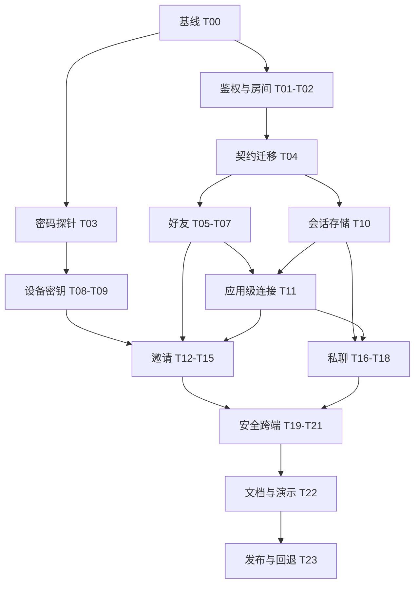

# 好友、私聊与协作邀请实施任务计划

日期：2026-09-23
状态：开发中；分支 `feature/friends-collaboration`，基线 `91cc03a`。按独立可验证任务逐次提交，实际进度见末尾记录。
设计依据：[分析与设计规格](../specs/2026-09-23-friends-messaging-collaboration.md)

## 1. 目标、已确认选择与交付边界

交付可演示的完整流程：

> 鸿蒙华为登录 → 添加好友 → 发送文字消息 → 从白板邀请好友 → 接受后共同编辑 → 绑定邮箱后在 Android 看到同一好友与聊天记录。

用户已确认：**私聊采用常规云端保存，优先实现跨端交流与邀请**。白板内容和邀请中的房间密钥继续端到端加密。

首版包含好友码、申请与接受/拒绝、好友列表、删除/屏蔽、文字私聊、历史与未读、应用内提示、离线收件箱、加密邀请、失败重试及设备安全验证。系统后台推送、群聊、文件/语音消息、私聊端到端加密、成员踢出和房间密钥轮换不计入本次交付。

“离线收件箱”表示内容保存在服务器、重新打开后可查看；不承诺进程被系统结束后立即弹出通知。好友和聊天记录跨端同步，个人笔记库不因此整体上云。

实现与验证使用隔离测试数据；生产发布仍须满足 T21–T23 的验收门槛。

## 2. 开发基线与执行规则

1. 邮箱服务与华为登录改动已通过 [PR #50](https://github.com/qinyre/FlowMuse/pull/50) 合并，本地主分支已同步到 `91cc03a`。T00 以该提交或包含它的更新 main 为基线确认测试环境，后续建议分支名 `feature/friends-collaboration`；无需再搬运未提交的账号改动。
2. 拟新增文件均为计划项，不表示当前仓库已有这些实现。路径以 `FlowMuse-App/`、`FlowMuse-Server/` 为根。
3. 先完成鉴权、房间归属和密钥交付探针，再开放定向邀请。界面开发可以使用内存 mock，但完成标志必须落到真实接口与持久化行为。
4. 沿用 Riverpod、HarmonyAwareHttpClient、安全存储、Go/pgx、现有 Socket.IO 服务和 PostgreSQL。新依赖必须有 T03 的证据，不预先引入商业 IM、Redis、独立聊天服务或消息队列。
5. 当前电脑不恢复 DevEco。HAP 构建、签名和鸿蒙真机测试由具备环境的打包电脑执行；未回传证据就标记未完成，不能用 Flutter 单测代替。
6. 本计划中的角色为责任范围，不要求增加人员或开启子代理；一个开发者可顺序完成，各任务保持可单独审阅。

## 3. 里程碑与依赖

| 里程碑 | 任务 | 可见结果 | 放行条件 | 粗估有效工作量 |
|---|---|---|---|---|
| M0 基础与风险验证 | T00–T04 | 契约、迁移和安全前置条件可执行 | 身份/房间回归、密码方案探针通过 | 4–6 人日 |
| M1 好友 | T05–T07 | 双端加好友、申请、删除与屏蔽 | 并发与越权测试通过 | 2–3 人日 |
| M2 应用级收件能力 | T08–T11 | 设备登记、消息持久化、全局收件提示 | 账号隔离、重连补查、设备私钥测试通过 | 3–5 人日 |
| M3 定向协作邀请 | T12–T15 | 验证设备后，一键邀请并进入白板 | 密钥保护、房间生命周期、端到端集成通过 | 4–6 人日 |
| M4 私聊与未读 | T16–T18 | 文字交流、历史、重试、多端未读 | 断网、乱序、重放和换号测试通过 | 2–3 人日 |
| M5 联调与发布 | T19–T23 | 测试记录、可安装包、线上发布与回退记录 | 自动检查与目标真机验收完成 | 3–4 人日 |

合计 **18–27 人日**，为单个熟悉项目开发者的规划估算，不是交付日期承诺，不包含等待签名材料、真机或外部评审的时间。邀请密码封装和鸿蒙工具链验证是主要不确定项；T03 完成后重新校准 M3/M5 工期。



## 4. 具体任务

### M0：基线、鉴权与风险验证

#### T00 · 固定开发基线与测试环境（优先级 P0）

- **位置**：Git 工作区、上一阶段登录计划、当前 CI/本地检查入口。
- **操作**：记录已部署账号改动及构建参数，形成包含它们的可复现基线；确认本地测试数据库与生产数据库分离；准备两个测试用户和第三个越权测试用户的隔离数据，不使用线上个人账号。
- **产出**：基线 commit/工作区清单、测试环境启动命令、目标平台与打包负责人约定。
- **验收**：可重新构建账号基线；邮箱、华为账号接口 mock 测试及原协作关键测试通过；测试连接串不会指向生产。
- **依赖**：无。后续所有任务依赖它。

#### T01 · 统一严格身份校验并补 Web Socket 握手路径（P0）

- **位置**：`FlowMuse-Server/internal/auth/http_api.go`、`tokens.go`、`user_store.go`、`internal/collab/hub.go`；拟新增必要的小型 session 验证 helper。
- **操作**：复用 token/session/User 校验，给社交 API 返回严格认证结果；Socket 同时支持原 Authorization 与 `handshake.auth.token`；两处同时提供且不一致时拒绝，不退回游客；社交 namespace 对游客始终拒绝。
- **产出**：HTTP/Socket 可复用的验证路径和会话撤销通知接入点；不改变原合法游客协作入口。
- **验收**：纯华为无邮箱用户可通过；无 token、伪造、过期、已撤销 token 均无法进入 social；Web 仅 auth.token 可认证；旧 HTTP/Socket 邮箱用户和游客协作回归通过。
- **依赖**：T00。

#### T02 · 修正房间重复创建与邀请所需归属检查（P0）

- **位置**：`internal/storage/room_store.go`、`internal/collab/http_api.go`、相关存储/集成测试。
- **操作**：沿 `roomsRoot` 与 `scene POST` 两个调用点复现 CreateRoom 冲突行为；已存在房间返回数据库真实归属，不能给另一调用者写 owner 角色；新建房间与 owner 成员写入具备事务一致性。为邀请提供明确“存在且未结束”的查询，不能把 LoadRoom 的兼容默认值当作存在证据。
- **产出**：房主权限判断和回归测试；若发现旧成员角色与真实 owner_id 不一致，先给出受影响记录计数和修复方案，不在迁移中无条件批量改写。
- **验收**：A 创建后 B 重复请求不能成为房主或获得定向邀请资格；A 重试不重复建房；普通成员原 PUT 快照保存、旧游客房间创建/结束保持可用；房间查询失败时新邀请闭合拒绝。
- **依赖**：T00、T01。

#### T03 · 邀请密码封装与设备信任可行性探针（P0，邀请发布门槛）

- **位置**：拟新增 `FlowMuse-App/lib/features/social/services/invitation_crypto.dart` 与对应测试；临时实验记录存本计划同目录或 troubleshooting。
- **操作**：核实固定 HPKE Auth 套件的实现来源、维护情况、许可证与 OHOS/Web 兼容性；优先复用已装 cryptography 原语。若需增加库或实现标准封装，记录选择依据，不把 X25519+AES 的随意拼接当成 HPKE。
- **产出**：固定套件/API、外层/AAD 编码规范、标准向量、至少一种独立实现互测证据、设备安全卡与指纹验证原型。
- **验收**：官方 Auth 模式测试向量完全匹配；错钥、伪造发送设备、错 AAD、篡改、公钥异常和超长信封全部拒绝；Dart VM 与 Web 往返；具备环境的 OHOS 构建/真机探针通过。确认未验证设备不会自动接收 roomKey。
- **依赖**：T00。若受工具链或协议问题阻挡，好友、会话存储、实时收件及纯文字私聊可继续；T08/T09 和 M3 的邀请能力等待验证，不得以明文降级放行。

#### T04 · 固定接口模型与幂等 schema（P0）

- **位置**：拟新增 `internal/social/models.go`、`internal/storage/social_store.go`；扩展 `room_store.go`、`user_store.go`；Dart `features/social/models/`。
- **操作**：按规格第 6/8 节确定字段、枚举、游标、错误 code；迁移顺序为 users 好友码/账号级密钥集合版本 → 关系/屏蔽/设备 → 会话 → 旧 room_invites 扩展 → 信封 → 消息与外键/索引。兼容字段按空值或默认值迁移，新接口用约束和验证保证完整性；关系表记录当前申请 ID，接口明确 expectedVersion 语义。
- **产出**：SQL 幂等迁移、前后端 JSON 样例、字段映射与错误契约。
- **验收**：空库、登录版本旧库、重复运行三路径通过；已有用户/密码/会话/房间保持；旧 room_invites 行不被删除；错误迁移导致社交不可用时不会由客户端触发清空本地笔记。
- **依赖**：T01、T02；密码字段格式在 T03 通过后冻结。

### M1：好友关系

#### T05 · 好友与屏蔽后端（P0）

- **位置**：拟新增 `internal/social/http_api.go`、`relationship_api.go`；`social_store.go`；`cmd/flowmuse-collab-server/main.go` 注册。
- **操作**：实现本人好友码懒生成、精确查找、申请/接受/拒绝/撤回、删除、屏蔽/解除；关系版本控制、请求幂等、最小公开资料投影、账号级额度。
- **产出**：规格第 8 节的关系/屏蔽接口，accepted 时事务内确保唯一会话。
- **验收**：自加、用户枚举、第三人处理申请、并发互加/重复接受、删除与发送竞态、屏蔽绕过均被正确处理；旧申请重试不能恢复新一轮已撤回/删除的关系；首次申请与无关系时屏蔽不会绕过行锁；返回资料不含邮箱、密码状态或华为标识。
- **依赖**：T04。

#### T06 · SocialRepository 与账号状态衔接（P0）

- **位置**：拟新增 `features/social/repositories/social_repository.dart`、`view_models/social_view_model.dart`；复用 account Provider 和 `shared/network/native_http_client.dart`。
- **操作**：HTTP 调用注入现有账号 token 读取能力；建立账号 generation、请求取消/过时丢弃、统一错误映射、好友列表分页与操作状态。
- **产出**：可 mock 的 Repository 边界与 Riverpod 状态；不新增通用网络框架。
- **验收**：A 请求未返回时退出并登录 B，A 的列表/异常/重试均不污染 B；401 清理社交状态，网络失败不清空正常账号会话。
- **依赖**：T05。

#### T07 · 好友页面、申请入口与导航（P0）

- **位置**：拟新增 `features/social/views/social_page.dart`、`widgets/`；修改 `app_router.dart`、`shared/widgets/app_shell.dart`、`features/library/widgets/library_sidebar.dart`、设置页账号区域。
- **操作**：添加“好友与消息”入口、好友码复制/搜索、资料预览、申请收件箱、接受/拒绝、好友详情与删除/屏蔽；当前阶段消息入口显示已有会话的空态。
- **产出**：窄屏/宽屏真实 Flutter 页面，沿用现有视觉组件。
- **验收**：游客引导后返回原位置；纯华为账号无邮箱也可使用；空态、失败重试、字体放大和深浅色正常；原笔记导航不回归。
- **依赖**：T06。

### M2：设备与应用级收件能力

#### T08 · 设备公钥登记与撤销后端（P0）

- **位置**：拟新增 `internal/social/device_api.go`；`social_store.go`。
- **操作**：登记当前账号设备、公钥和 keyId；读取本人/好友接收设备；实现不可原地换钥、users 行上的整体 keysetVersion、数量限制、撤销与账号归属校验，登记/撤销与邀请在统一锁序下串行化。
- **产出**：设备管理 API 和登记/撤销测试。
- **验收**：不能登记到其他用户、读取非好友设备或领取其他账号的信封；同账号不同设备即使取得密文，也不能用错误私钥解密；同 keyId 不同公钥冲突；并发登记/撤销单调更新 keysetVersion。
- **依赖**：T03、T04、T05。

#### T09 · 端侧密钥、安全卡和信任记录（P0）

- **位置**：拟新增 `features/social/services/social_device_key_store.dart`、`invitation_crypto.dart`、设备安全卡 UI；复用 OHOS secure-storage facade。
- **操作**：按服务地址/账号/设备隔离私钥；生成并导入公开设备安全卡；双方核对后固定对方指纹；实现丢钥、新设备、换钥、达到设备上限及撤销提示。
- **产出**：本机密钥生命周期与可操作的首次设备验证流程；公钥列表刷新不能自动增加信任。
- **验收**：Android/鸿蒙/HTTPS Web 读写验证；退出再登录原设备可用；换号不交叉读取；清浏览器数据后提示新设备；普通笔记备份导入不能注入设备信任或导出私钥。
- **依赖**：T08。

#### T10 · 会话、消息和幂等存储基础（P0）

- **位置**：`social_store.go`；拟新增 `internal/social/conversation_api.go`；Dart 会话/消息模型。
- **操作**：会话参与者校验、事务内单会话序号分配、消息分页、clientMessageId 去重、邀请卡片类型与关系状态校验；为后续私聊和邀请提供共同存储能力。
- **产出**：只通过 HTTP 写入的可靠消息基础和隔离 PostgreSQL 集成测试。
- **验收**：事务回滚不留下幽灵消息；先开始后提交的并发发送不使补拉跳过消息；重复请求只写一条；同 ID 不同正文 409；BIGINT 在 Web 序列化后不失真。
- **依赖**：T04、T05。

#### T11 · `/social` 实时连接与收件箱补查（P0）

- **位置**：拟新增 `internal/social/hub.go`、`features/social/services/social_realtime_transport.dart`、应用根部 session 绑定；调整 main 注册。
- **操作**：鉴权后加入服务端私有 user room；数据库提交后发送 ID/版本提示；应用级连接与白板连接生命周期分离；登录/重连/前台恢复补拉，前台 30 秒摘要兜底，退出和失效 session 清理。
- **产出**：全局未读提示与刷新机制，Socket 事件契约和重连测试。
- **验收**：未打开白板也能收到好友申请；退出白板不关闭社交连接；退出账号不能继续接收；丢一次广播和服务重启后数据能补回；客户端不能订阅第三人收件组。
- **依赖**：T01、T05、T06、T10。

### M3：定向协作邀请

#### T12 · 邀请、信封和卡片的原子事务（P0）

- **位置**：拟新增 `internal/social/invitation_api.go`；`room_store.go` 与 `social_store.go` 中选定一处管理邀请事务。
- **操作**：真实房主/好友/屏蔽/房间存续检查，设备公钥集合版本检查，创建邀请+信封+一条卡片；幂等创建、收件箱列表、拒绝、撤销和有效期。
- **产出**：只存密文信封的邀请接口；旧 room_invites 与新格式共存。
- **验收**：半途失败不出现“卡片存在但无可用邀请”；假房主、陌生人、结束房间、撤销设备全部拒绝；只为指定接收人生成一条卡片；重试不重复增加未读。
- **依赖**：T02、T08、T10、T11。

#### T13 · 接受、补发、加入回执与竞态（P0）

- **位置**：`invitation_api.go`、存储事务；相应后端集成测试。
- **操作**：接受时只按本人名下有效设备返回对应信封；记录 accepted 与 joined_at 两种语义，后者仅为加入成功回执而非当前在线证明；原创建者为经验证的新设备补发；对结束房间、删除/屏蔽、到期和发送/接收设备撤销重新校验。
- **产出**：明确且可重试的状态机。
- **验收**：接受响应丢失可重试；加入网络失败仍可再次加入；受邀账号另一设备无信封时有明确错误；非参与者猜 ID 不能探测内容；接受与撤销/屏蔽并发按事务顺序得到唯一结果。
- **依赖**：T12。

#### T14 · 白板发邀请与端侧加密（P0）

- **位置**：`whiteboard_page.dart`、whiteboard 对外 Provider；拟新增 `app/services/collaboration_invite_coordinator.dart` 和好友选择弹层。
- **操作**：房间与首个快照就绪后取当前协作上下文；检查房主与接收设备信任；逐设备封装密钥；将纯密文请求交给 SocialRepository。邀请入口不导航离开白板。
- **产出**：从真实白板发送好友邀请；未建房、非房主、无已验证设备等提示。
- **验收**：白板正常书写时打开/关闭弹层不重启房间；ownerKey 从未进入邀请；切换账号/房间后旧封装任务不能发出；keysetVersion 变化后安全刷新，不静默使用新公钥。
- **依赖**：T03、T09、T12。

#### T15 · 收件卡片、深链和加入白板（P0）

- **位置**：拟新增 `invitation_card.dart`、邀请详情页；`app_router.dart`、邀请协调器与现有 whiteboard 加入流程。
- **操作**：实现加入/拒绝/已失效/需要补发的卡片；仅 inviteId 的深链；未登录返回目标；用已验证的发送设备公钥和本机私钥解密信封，再经原 Repository 加入，并在白板就绪后发送 joined 回执。
- **产出**：两账号从好友邀请到同一画布的完整演示。
- **验收**：处理未保存本地笔记、正在主持另一个房间、同房重复点击和换号；不覆盖/合并原笔记；密钥不进 URL query 或普通消息；错误设备/密文不能打开白板。
- **依赖**：T13、T14。

### M4：私聊、未读与可靠性

#### T16 · 文字发送、历史和前台会话 UI（P0）

- **位置**：`conversation_api.go`；拟新增 `features/social/views/conversation_page.dart`、消息气泡、输入框与失败重试组件。
- **操作**：文字长度/字节验证、纯文本呈现、历史上下分页、发送中/成功/失败状态、相同 clientMessageId 重试；检测 FlowMuse 协作密钥链接并引导转邀请卡片。
- **产出**：好友文字交流和多端服务器历史；白板内复用同一会话组件作侧面板/弹层。
- **验收**：重复发送、空白、Emoji/中文长度、HTML 文本、超时后实际已落库、发送时被屏蔽均正确；白板弹层不结束房间或误吞画笔输入。
- **依赖**：T07、T10、T11；包含邀请卡片展示时依赖 T15。

#### T17 · 未读游标和同账号多端同步（P0）

- **位置**：会话 API/store、SocialViewModel、消息列表可见性与应用生命周期监听。
- **操作**：账号级 read_seq、未读统计、查看可见消息后更新游标、另一设备读后同步；邀请卡片算消息，但其状态刷新不再重复增加未读。
- **产出**：侧边栏、会话列表、前台提示一致的未读数字。
- **验收**：本人发言不计入未读；后台接收不自动已读；乱序较小游标不回退；分页加载历史不误标最新消息；A 端阅读后 B 端正确清零。
- **依赖**：T16。

#### T18 · 重连、过时响应与交互节流（P0）

- **位置**：SocialRepository/ViewModel、SocialRealtimeTransport、应用级消息入口。
- **操作**：实现前台恢复补查、消息 seq 去重、分页与实时到达合并、账号 generation；合并频繁列表刷新，提示不抢焦点；限制并发请求和连接数。
- **产出**：故障场景自动测试和应用内通知行为说明。
- **验收**：断网/重连/后端重启不丢已落库历史、不重复消息；A 的晚到响应不污染 B；白板连续书写时社交提示不触发画布全量重建；社交服务不可用仍能打开本地笔记。
- **依赖**：T11、T15、T17。

### M5：安全、跨端、文档与发布

#### T19 · 安全与并发回归（P0）

- **位置**：后端 auth/storage/social 测试，Flutter social/crypto/account/路由测试。
- **操作**：执行第 6 节安全矩阵；用专用测试密钥扫描 DB/API/日志；限流按用户隔离；审核所有 public DTO、错误文本、重连日志及普通消息链接识别。
- **产出**：用例与结果记录，密码封装审阅意见及修复。
- **验收**：没有越权跨账号读取或发邀请的路径，错误设备私钥不能解密；屏蔽竞态闭合；未知版本/超大信封拒绝；新增日志无秘密；HPKE 标准向量和独立互测一致。
- **依赖**：T15、T18。

#### T20 · 自动检查、构建与性能回归（P0）

- **位置**：现有 Flutter/Go 测试体系和协作性能测试，不另搭测试框架。
- **操作**：先跑模块专项，再跑必要全量；运行格式/静态检查、Web release、Android 构建；隔离环境模拟至少 20 个并发登录连接及断线恢复，测量查询、发送和补查耗时。
- **产出**：命令、版本、测试结果、构建参数与有限负载下的测量数据。
- **验收**：无新增 analyze error；Go test/vet 与 Flutter 全量通过；旧协作调度、手写响应、房主权限和链接加入不回归；不把测试机数据宣称为生产容量。
- **依赖**：T19。

#### T21 · 鸿蒙/Android/Web 联合真机验收（P0）

- **位置**：具备 DevEco/OHOS SDK 的打包电脑、鸿蒙设备、Android 设备与 HTTPS Web 测试环境。
- **操作**：构建签名 HAP；运行第 7 节联合脚本；验证密钥首次生成、重启读取、设备安全卡、新设备补发、账号切换、后台恢复以及真实网络下的消息与邀请。
- **产出**：设备/系统版本、构建 commit、安装包摘要、录屏和问题记录。
- **验收**：目标双端完整流程通过；HAP 能构建且原生华为授权成功；Web auth.token、存储清理及深链验证通过。缺少工具链或设备时明确暂停该平台放行，不把未测写成成功。
- **依赖**：T20；T03/T09 的平台探针应尽早执行，不能全部拖到最后。

#### T22 · 文档、隐私说明与比赛演示（P1，上线前完成）

- **位置**：`docs/项目说明/项目需求.md`、`docs/技术设计/前端架构.md`、`接口设计.md`、`数据模型.md`、`FlowMuse-Server/README.md`、应用隐私页及本计划。
- **操作**：把经验证的新能力写入正式文档；明确云端私聊和白板加密区别、首次设备验证、旧邀请换设备需补发、离线提示范围、删除好友不等于撤销已得白板密钥。
- **产出**：用户说明、开发接口文档、演示脚本与证据索引；当前“拟实现”项按实际状态更新。
- **验收**：文档与代码/部署一致，不把普通好友聊天算作已验证的鸿蒙原生能力，不声称登录会同步所有本地笔记。
- **依赖**：T19–T21。

#### T23 · 分阶段发布与回退演练（P0）

- **位置**：现有 Docker Compose、PostgreSQL、Nginx 版本化 Web 目录和客户端构建流水线。
- **操作**：备份数据库/配置/镜像/静态版本；先部署兼容 schema 与后端，再 Web，最后发原生客户端；按下方发布清单验证开关与回退。
- **产出**：发布清单、备份路径、实际版本、线上检查结果和回退步骤。
- **验收**：只重建应用容器；既有 SMTP、华为凭据与业务服务参数保留；消息/邀请事务、API 健康、Web 深链和 WSS 检查通过。关闭社交入口或回退到兼容 schema 的后端不会删除好友、聊天或密文信封。
- **依赖**：T20–T22。构建成功不代替真机验收，新增入口不提前对普通用户开放。

## 5. 文件落点与复用规则

| 范围 | 既有文件 | 拟新增或扩展内容 |
|---|---|---|
| 认证 | `FlowMuse-Server/internal/auth/*`、`internal/collab/hub.go` | 严格会话验证与 auth.token 读取，保留游客协作边界 |
| 服务端社交 | `cmd/flowmuse-collab-server/main.go` | `internal/social/{models,http_api,relationship_api,conversation_api,device_api,invitation_api,hub}.go`，可按实际规模合并文件 |
| 存储 | `internal/storage/room_store.go`、`internal/auth/user_store.go` | `social_store.go` 与 room_invites 扩展；邀请事务只保留一份实现 |
| 客户端社交 | 现有 account Providers、HTTP 与主题 | `features/social/{models,repositories,view_models,views,widgets,services}` |
| 邀请编排 | whiteboard 公开 Provider、既有 joinRoom | `app/services/collaboration_invite_coordinator.dart`，不在 social 内直接操作 Scene/编辑器 |
| 导航 | `app_router.dart`、`app_shell.dart`、`library_sidebar.dart` | 页面路径、侧边栏入口、返回目标与全局未读 |
| 白板交互 | `whiteboard_page.dart`、现有协作菜单 | 好友选择/消息弹层；不改变 Excalidraw 元素、LWW、笔型和快照协议 |
| 测试 | 既有 Go test、Flutter test 与 PostgreSQL 测试方式 | 按源码目录镜像；服务端用隔离库，网络/平台使用 mock 或明确集成环境 |

这是一份文件落点指导，不要求为凑结构创建空文件、通用事件总线、单实现工厂或新的框架。需要分离的是真实职责与测试边界。

## 6. 自动验证矩阵

| 编号 | 场景 | 必须观察的结果 |
|---|---|---|
| A01 | 无 token/过期/撤销/无已验证身份 | social REST 与 Socket 均拒绝；原游客白板入口仍可用 |
| A02 | 浏览器仅 auth.token；header/auth 冲突 | 前者认证成功，后者拒绝；不从 query 接收 token |
| F01 | 同时互加、并发接受、重复或较早轮次 clientRequestId | 一条关系、一条会话；过时版本不覆盖新状态、不恢复已取消关系 |
| F02 | 删除/屏蔽与发送或接受并发 | 提交后的关系限制有效，不出现半完成邀请或幽灵消息 |
| F03 | 修改 relationshipId/userId/好友码 | 不处理第三人的申请，不返回邮箱或敏感身份字段 |
| M01 | 服务器已落库但客户端超时，再次发送 | 返回原消息；不会重复气泡和未读 |
| M02 | 发送事务提交乱序、分页并发、事件重复 | 消息序号可靠补齐，没有永久跳过或覆盖 |
| M03 | 自己发消息、多端同时已读、后台接收 | 未读不含自己，游标单调，后台不自动清零 |
| M04 | 后端重启/丢提示/前后台切换 | 前台恢复或兜底补查后与数据库一致 |
| I01 | 非房主重复创建房间后发邀请 | 仍被拒绝；真实 owner 不变 |
| I02 | 过期/房间结束/撤销/删除好友 | 无法新领信封；UI 有明确失效状态 |
| I03 | 接受响应丢失、join 网络失败、重复点击 | 可恢复重试，accepted 不被错误展示成已经连上白板 |
| K01 | 错设备/错钥/伪造发送设备/错 AAD/篡改/未知套件 | 解密拒绝；没有明文降级 |
| K02 | 未验证设备、新钥替换、清浏览器数据 | 不自动继承信任，需验证/补发，旧账号秘密不串号 |
| K03 | 测试 roomKey/ownerKey 出口扫描 | 不出现在 DB 明文、消息正文、日志、通知、新邀请 URL |
| U01 | 房主在白板里打开好友或聊天面板 | 页面及协作会话保持，画笔输入与现有快捷操作正常 |
| U02 | 从有本地内容的笔记接受邀请 | 用户当前工作被保留；原笔记不被远端场景覆盖 |
| U03 | 退出 A 后晚到 HTTP/Socket 回调到达 B | B 看不到 A 的联系人、历史、未读、错误或私钥 |
| R01 | 原邮箱/华为登录、游客链接、协作附件、导出备份 | 全部通过已有回归；新模块失效不影响本地笔记 |

开发中按模块跑专项。合并/发布前在具备对应工具链的环境完成：

```text
FlowMuse-Server:
  go test ./...
  go vet ./...
  运行项目约定的隔离 PostgreSQL 集成测试入口

FlowMuse-App:
  dart format --output=none --set-exit-if-changed <本次改动的 Dart 文件>
  flutter analyze
  flutter test
  flutter build web --release --no-web-resources-cdn --pwa-strategy=none
    --dart-define=FLOWMUSE_COLLAB_SERVER_URL=https://api.flowmuse.cloud
    --dart-define=FLOWMUSE_SHARE_ORIGIN=https://app.flowmuse.cloud
  flutter build apk --debug <相同生产域名参数；测试环境替换为测试域名>
  flutter build hap <在打包电脑，核对实际签名与参数>
  git diff --check
```

以上多行构建参数是说明形式，执行时按实际 shell 正确续行。已有历史 warning 单独记录，不把它们算作本次新增；所有声称通过的命令必须保留实际结果。

## 7. 双端验收脚本

1. 鸿蒙设备 A 使用华为账号登录，暂不绑定邮箱；Android 设备 B 用另一测试邮箱登录。
2. A/B 通过好友码申请并接受，验证列表、昵称/头像和申请通知；第三个账号 C 不能读这条关系与会话。
3. A/B 交换并验证接收设备安全卡。改变一位指纹或换公钥应失败；通过后保存到各自账号的本机信任记录。
4. A 发文字，B 查看并回复；B 暂时断网，A 继续发送，B 恢复后补齐历史且不重复。
5. A 打开自己的笔记创建房间，邀请 B；B 从卡片加入。双方各画一笔，验证同步、房主身份与附件。
6. A 在白板内打开私聊弹层并回复，再关闭继续书写，房间不得结束或重新创建。
7. B 退出房间再通过有效邀请重新加入；模拟一次加入中断，验证可重试。A 结束房间后原卡片失效。
8. A 绑定邮箱并在另一 Android/Web 设备登录同一账号，好友、聊天和未读一致；新设备没有旧邀请信封时明确提示验证并补发。
9. 删除好友、屏蔽、解除屏蔽、重新添加；检查旧历史可读、未完成邀请受限制，解除屏蔽不会自行恢复好友。
10. 退出 A 登录 B，检查不会显示 A 的私聊、通知、设备信任或旧操作结果；新旧链接协作均作回归。

演示录屏使用专用测试数据，不展示 token、私钥、真实 roomKey、真实私人聊天或不必要的邮箱。记录服务端/客户端版本，确保演示的功能来自同一组构建。

## 8. 发布、回退与完成定义

发布顺序：兼容性后端与幂等迁移 → Web → Android/OHOS 客户端 → 打开已经验收的入口。上线前沿用前次部署方法备份数据库、受控 .env、生产 Compose、镜像与 Nginx root，不用开发 Compose 覆盖生产凭据。

至少保留一个服务端 `FLOWMUSE_SOCIAL_ENABLED` 总开关；关闭时包括 `/api/social/me` 在内的社交接口返回明确 503、停止社交通知，客户端隐藏社交入口并保留可重试提示，不把 503 当作账号退出或全局启动失败。为分里程碑内测需要分别开放邀请/文字时，用 `/api/social/me` 的 capabilities 描述实际可用能力，不引入远程配置系统。

回退优先关闭入口并部署兼容新增 schema 的版本，不删除关系、消息或设备记录；已交付的密钥无法靠撤销邀请追回。紧急关闭社交通知也不能关闭原协作 namespace。

完成必须同时满足：

- [ ] T00–T23 的适用任务有代码/文档与真实检查证据。
- [ ] 好友、私聊和邀请三条用户流程在目标双端通过。
- [ ] 私聊云端保存与邀请设备验证的使用边界清楚。
- [ ] 关键越权、并发、重连、换号和密钥测试通过。
- [ ] 原账号、游客协作、白板编辑与本地数据没有回归。
- [ ] HAP/Android/Web 构建与各自实际验收状态如实记录。
- [ ] 生产备份、版本、上线检查与可执行回退步骤齐全。

如果某里程碑受阻，应交付其之前已经独立验收的能力，并保留未完成项；不能把“能发通知”当作已完成可靠聊天，也不能把“拿到邀请”当作已加入白板。

## 9. 实施记录

- T10/T17（服务端）：HTTP 持久发送、前后游标分页、唯一消息 ID、事务内序号和单调已读完成；本人消息不计未读，屏蔽后保留历史。并发重发/有序补拉、强制事务回滚、屏蔽竞态、第三人读写、已读回退测试通过。消息限额 60/分钟且 10/10秒；同一已落库消息重试不消费发送额度。

- T05（HTTP 部分）：好友/屏蔽 API 接入现有认证与启动流程；所有入口严格认证、限制 64 KiB JSON、检查未知字段、按账号限流且限制限流内存。总开关默认关闭，社交迁移失败不影响白板。验证纯华为账号、撤销会话、字段脱敏、坏输入与关闭开关。

- T05（事务部分）：精确查找、申请/接受/拒绝/撤回/删除、屏蔽/解除与唯一会话完成。统一按 ID 锁定双方 users，首次申请与屏蔽也串行；重复申请/接受幂等，过期版本不能恢复旧关系。隔离数据库的生命周期、第三方越权、并发八次重试和无关系时屏蔽竞态测试通过。

- T04（好友/文字部分）：幂等 schema、最小公开 DTO、字符串版本/消息序号、好友码与输入校验完成；隔离库重复迁移、唯一约束、中文/Emoji、协作密钥链接拒绝测试通过。每日申请额度用 users 上的日期/计数两列实现，无需额外事件账本。设备及邀请字段留待 T03 放行。

- T02：CreateRoom 使用事务保存房间与真实 owner 成员；冲突不替换归属或空 ownerKeyHash。成员角色从房间 owner_id 推导，历史错误 owner 角色在读取时降为 editor，不批量改写旧数据。新增严格 FindRoom。隔离 PostgreSQL 验证重复创建、伪造 owner 角色、游客房间、缺失房间及已结束房间；storage/collab 测试与 vet 通过。

- T01：统一 token/session/身份验证，Socket 支持 auth.token 并拒绝冲突凭据；原游客入口保留。`go test ./internal/auth ./internal/collab` 与专项鉴权测试、`go vet` 通过。隔离 PostgreSQL 17 容器使用临时内存数据目录、独立端口和 `_test` 数据库，每个测试独立 schema；未接入生产业务库。

- 2026-09-23：从与 origin/main 一致的 `91cc03a` 新建 `feature/friends-collaboration`。当前仅有本计划和设计稿未提交；先提交方案，再按鉴权、房间归属、好友、消息等职责分别提交。沿用上一轮已通过的账号基线检查；新增变更各自补专项验证。
- 平台边界：本机不恢复 DevEco；T03 的 OHOS 密码探针和 T21 真机门槛尚未满足，定向加密邀请不得提前开放。继续完成不依赖该门槛的好友和云端私聊，并明确记录待验证项。
