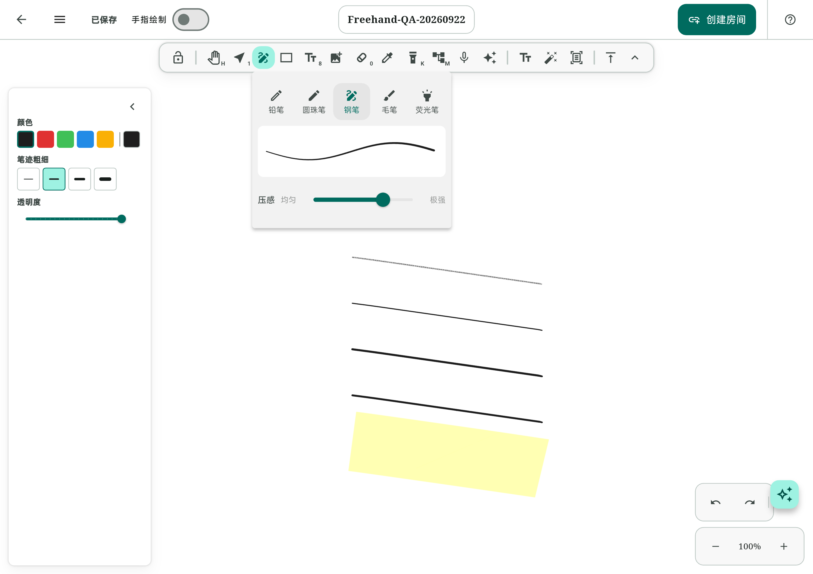

# 自由书写优化实施与验证记录

日期：2026-09-21—22。分支：`feature/freehand-experience`。起点：`d9ab1927ac496bde255288783afb739ef32948d5`。

对应[实施方案](../plans/2026-09-21-freehand-experience-nonregression-plan.md)。本轮采取保守交付：默认启用确定性的缺陷修复与冗余工作削减；静态场景 Picture 复用仍由原有 `FLOWMUSE_LAYERED_WET_INK` 控制，默认 `false`。实机自动回放的注入抖动未达门槛，不能据此宣称延迟、帧率或真实触控笔手感验收通过。

## 实际变更

| 项目 | 结果与边界 |
| --- | --- |
| 首点反馈 | 五笔在 accepted down 后请求正常帧绘制；freedraw 允许单点预览，line/arrow 继续要求两点。没有等待第二点、增加预测或改变原始采样。 |
| 取消残影 | 平板复测发现默认画布取消后仍显示已清空的预览，直到下一次重绘。共享取消入口补发通知；真实键盘原来直接重置工具，现与程序快捷键复用 `dispatchKey`，执行完整的取消/协作清理。工具切换、视口手势仍由原有调用方通知，销毁不通知。指针取消和键盘路径分别有修复前失败、修复后通过的回归证据。 |
| 铅笔零长点 | 共享采样器提供铅笔本身的圆点几何，Canvas/SVG/湿墨复用；修复单点和两重合点不可见。正常线条参数不变。此项会让历史 v2 零长铅笔点恢复可见，属于明确修复差异。 |
| v2 缓存命中 | 铅笔/毛笔仅在缓存 miss 后分配绝对坐标列表；缓存键、绘制顺序与终稿保持原样。 |
| 协作活动计时 | 离线不启动 presence 调度；在线由一个截止时间计时器依据最后活动时间更新 active/idle/away。输入不再每点取消并新建两个 Timer；房间退出和页面销毁仍取消。 |
| 场景派生数据 | 不可变 Scene 内惰性复用排序结果与首个有效绑定文字索引。排序接口仍返回新列表；保持 null index 排序、重复绑定首项、软删除和远端更新语义。 |
| 噪声压力颗粒选择 | 将 Set 的既有插入顺序物化一次，替代 cap 分支反复 `elementAt` 扫描。冻结测试锁定保留边序列；未改颗粒数、压力极值选择、随机种子和正常笔形。 |
| 长铅笔 SVG | 原循环在跳过颗粒时没有推进计数，超过 4000 颗粒后全部跳过。改为按源索引步进，保留预算内纹理；Canvas 及输入链路不变。 |
| 笔型面板 | 五笔名称常显，使用实际 ElementRenderer 展示当前颜色、笔宽、压力灵敏度和透明度的曲线；预览独立重绘，无逐帧动画/Timer。支持双倍字号，保留原触控笔单击通道和每笔独立偏好。 |
| 分层候选 | 同一 Canvas 上回放单份 `ui.Picture`，保留荧光笔 darken 与静态→远端→本地→交互层序。缓存按 Scene、视口、裁剪、尺寸、图像、主题/配置、聚焦、父变换和 shader 状态失效并释放；默认未启用。 |

没有新增依赖、数据库字段、协作协议或原生通道。没有降低采样率、延迟抬笔提交、加入额外平滑、自动预测，或修改用户选定的压力/笔宽参数。

## 为什么保留分层开关关闭

`OPD2404` Android 16 平板通过 ADB 连接，显示信息报告 120Hz，Flutter 为 `3.41.10-ohos-0.0.1-canary1`，渲染后端为 Vulkan Impeller。自动事件是合成 stylus 输入，不是物理触控笔，也不是 stylus-to-photon 测量。

首次完整界面回放被浮动属性面板挡住起点，出现零 accepted/零终稿。该组原始 JSON 被判无效。已把回放区域移出控件，并加入预热阶段“每笔必须命中画布并生成元素”的断言。

修正后 1000 元素快速短笔回放确实生成了笔迹，但注入时刻严重落后。部分已完成诊断场景的原始计数如下；它们不是正式性能基线，也不能从左右差值推导优化收益：

| 笔型 | 分层 | 完成笔画 | 注入抖动 P95 | 判定 |
| --- | --- | ---: | ---: | --- |
| 铅笔 v2 | false | 571 | 59.661ms | 无效 |
| 铅笔 v2 | true | 603 | 66.437ms | 无效 |
| 圆珠笔 | false | 588 | 75.095ms | 无效 |
| 圆珠笔 | true | 623 | 87.856ms | 无效 |
| 钢笔 | false | 485 | 134.022ms | 无效 |

这里还暴露了原 runner 的工作量问题：以墙钟截止会让两边生成不同数量的元素。因此后续 runner 改为固定笔画数，慢的一边允许更久完成，另记录实际时长。

随后以 100 元素、完整编辑器界面运行五笔 × false/true 的真正 30 秒单笔回放，10 个场景均完成测试流程。已观察到的抖动仍超标，例如铅笔 false/true 的 P95 为 31.253/20.404ms，圆珠笔为 20.515/10.149ms，荧光笔为 20.685/8.897ms。门槛保持 P95 ≤4ms、最大值 ≤16ms，没有为了通过而放宽。该次 VM service 初始日志已滚出缓冲区，host driver 未连接成功，只保留了设备进度/部分计数日志，不能作为完整 raw 数据或正式验收。

因此没有继续堆积无效五轮数据，没有宣称“120Hz 已达标”，也没有把候选路径设为默认。真实压力、掌触、低速小字、实际笔尖延迟和主观盲测仍需持笔人工验证；HarmonyOS 真机未连接，本次 Android 观察不能外推到其余平台。

## 已证实的 CPU 重复工作

修正起点后的诊断期间取得 27.28 秒 CPU 采样窗口，17,721 个 samples。此采样仅用于定位热点，受测试负载影响，不是优化前后时间收益：

- `StaticCanvasPainter._paintScene` 出现在 13,005 个样本调用栈中。
- classic 自由笔轮廓绘制链路仍大量重算，`FreedrawRenderer.draw` 的 inclusive ticks 为 6,068。
- `Scene.orderedElements` 的 inclusive ticks 为 2,026；`findBoundText` 的 exclusive ticks 为 1,286。

这触发了 Scene 排序/绑定索引的最小优化。未扩展为四叉树、整笔前缀冻结或多套渲染缓存。完整候选颗粒生成、超长笔活动轮廓重算仍存在；其进一步改造需要证明历史几何完全等价，不能用减颗粒或近似分块换取性能。

## 验证与产物

关键回归已经包括：五笔首点/终笔/取消、线箭头两点门槛；铅笔零长 Canvas/SVG 可见；湿墨/终稿一致；缓存 miss/hit 与直绘逐像素相同（图片、叠色、classic shader、父缩放旋转、25%/100%/400% 视口、聚焦与裁剪）；静态缓存命中、提交/撤销失效；协作活动计时；场景远端更新/绑定优先级；长 SVG 纹理；笔盒大字号、偏好与触控笔点击。

包含取消残影修复的最终全量回归为 **1,803 passed / 4 skipped**，`flutter analyze` 为 **No issues found**。原有 4 项跳过没有改成通过。正常 Android arm64 release 和 Web release 均完成构建；Android 正常包使用 `lib/main.dart`、`FLOWMUSE_LAYERED_WET_INK=false`，不携带自动回放入口。构建仍有既有 CupertinoIcons 字体声明提示，没有更改字体依赖来掩盖它。

调试证据位于 `FlowMuse-App/build/`，被 Git 忽略，清理构建目录会删除；关键失败原因与计数已在本文保留。

| 文件 | 用途 |
| --- | --- |
| `build/freehand-full-tests-final.log` | 全量回归 |
| `build/freehand-analyze-final.log` | 静态检查 |
| `build/freehand-release-build.log` | 默认开关关闭的正常 Android release 构建 |
| `build/freehand-web-build.log` | Web release 构建 |
| `build/freehand-cancel-before.log` | 取消预览残留的修复前失败，覆盖真实 widget 通知链 |
| `build/freehand-keyboard-cancel-before.log` | 真实键盘分发绕过控制器取消入口的修复前失败 |
| `build/freehand-svg-before.log` | 长 SVG 纹理丢失的修复前失败 |
| `build/freehand-first-ink-before.log` | 首点/铅笔点的修复前失败 |
| `build/freehand-perf-20260921/ab-layered-interrupted-summary.jsonl` | 已接收输入但抖动超标的中止诊断计数 |
| `build/freehand-perf-20260921/cpu-invalid-short-strokes.json` | 定位重复排序、查找、轮廓重算的 CPU 采样 |
| `build/freehand-long-device-final.log` | 真正 30 秒单笔的结束日志，不能替代完整性能 raw |

runner 延续现有工具：五笔/重复次数/完整界面参数、同包 A/B 交替、固定工作量、真长笔 fixture、失败报告保存和矩阵容器读取。汇总器继续拒绝 dirty 工作区、计数不符、抖动超标、非物理设备、样本/帧覆盖不足等结果，不混合笔刷、版本或界面模式。安全运行方式见 [integration_test/README.md](../../../FlowMuse-App/integration_test/README.md)。

## 正常发布包的平板功能复测

在 `Freehand-QA-20260922` 空白无限画布中，以 Android `input stylus` 原生合成事件检查功能。手指绘制保持关闭，缩放为 100%；事件可验证输入链与显示结果，但不能模拟物理笔压、笔尖摩擦、掌触或测量输入延迟。

| 检查 | 观察结果 |
| --- | --- |
| 五笔选择 | 铅笔、圆珠笔、钢笔、毛笔、荧光笔均可触控笔单击选择，生成各自笔迹。 |
| 首点 | 铅笔只有 DOWN、没有 MOVE/UP 时已显示点；UP 后正常保留。 |
| 指针取消 | 修复后的 DOWN → CANCEL 清除本次预览，原笔迹保留，不需要下一次操作触发重绘。 |
| 键盘取消 | 正常包中 DOWN → `KEYCODE_ESCAPE` → UP 后，本次钢笔点消失且未提交，原笔迹保留；修复前同一路径有残影。 |
| 撤销/重做 | 铅笔线条撤销后消失、首点保留；重做后线条恢复。 |
| 保存与覆盖安装 | 返回资料库后笔记存在；`adb install -r -t` 更新正常包，重开同一笔记，五条笔迹和首点均保留。 |
| 笔型面板 | 五个名称和实际渲染曲线完整显示，无截断；大字号另由 widget 测试覆盖。 |

正常 APK 留在 `FlowMuse-App/build/freehand-experience-release.apk`，已经安装到连接的平板。以下图片只有本轮创建的 QA 内容：

[保存重开的五笔样本](assets/freehand-20260922/saved-five-brushes.png)；[取消前](assets/freehand-20260922/before-cancel.png) / [取消后](assets/freehand-20260922/after-cancel.png)（新增测试点在设备坐标 x=2200、y=700）。

## 测试工具卸载事故

首轮 `flutter drive` 的默认退出清理实际执行了卸载。下一次启动出现数据库 `onCreate`，因此原应用私有本地数据可能已经被清除，不能声称仍然保留。已即时告知用户并询问是否有重要笔记需要恢复。

后续改用 `adb install -r -t` 保留安装，禁止安装失败后卸载重试；直接连接 driver 不执行自动卸载。README 的 `flutter drive` 示例全部增加 `--keep-app-running` 并写明风险。

系统 `bmgr list sets` 没有找到自动恢复集。下载目录仍有 5 份 `.excalidraw` 导出，已复制到仓库外 `D:/Program/HarmonyOS/FlowMuse-device-recovery-20260922/`；它们可能只是部分导出，不保证覆盖全部原笔记、标题、笔记本和标签。用户随后明确答复“都是测试数据，继续优化”，因此保留备份、不执行恢复。后续 QA 仅使用新建的 `Freehand-QA-20260922` 笔记。

测试结束前，一条停止并重新启动测试应用的组合命令被自动审批以 `blocked by policy` 拒绝；没有执行该命令，现有测试自行结束后再处理正常应用构建与验收。
