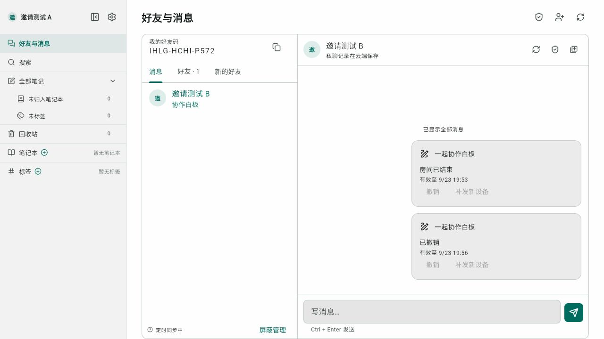

# 好友、私聊与协作邀请验证记录

日期：2026-09-23。分支：`feature/friends-collaboration`。基线：`91cc03a`。

## 实现与发布状态

好友码、申请状态机、删除/屏蔽、文字私聊、历史补查、失败重试、未读及白板消息弹层已实现。本轮补齐设备密钥/安全卡信任、HPKE Auth 邀请、接受/拒绝/撤销/补发、白板加入和 joined 回报。`FLOWMUSE_SOCIAL_ENABLED` 与 `FLOWMUSE_SOCIAL_INVITATIONS_ENABLED` 默认关闭；仅在隔离预览环境开启，生产未合并/部署。鸿蒙实机验收按用户要求由队员执行。

每项功能和重要修复单独提交。未提交真实凭据、签名材料、构建产物或用户聊天数据。原界面图来自本地合成样例；下方邀请卡截图来自隔离后端的两个测试账号，显示联调后已结束/撤销的邀请。



## 自动检查

| 检查 | 结果与边界 |
|---|---|
| `flutter test --no-pub` | 1763 通过，6 项跳过（5 项既有 + 1 项需显式启用的 HTTP 联调；后者已单独执行通过）；含账号隔离、设备核验、密码向量/篡改、邀请重试、白板取消与连接就绪 |
| `flutter analyze --no-pub` | 无 error；仅既有 `build/nav_compact_screenshot_test.dart:199` 的 protected member warning。新增模块专项分析无问题 |
| Go 测试与 vet | `go test ./...`、`go vet ./...` 通过；鉴权故障修复后重跑 auth/social/collab 与全量 vet 通过 |
| PostgreSQL 迁移与事务 | 独立 PostgreSQL 17 临时容器，数据库 `_test` 后缀、每测试随机 schema；重复迁移、旧账号、并发申请/发送、屏蔽竞态、第三人越权、房间归属与撤销验证通过 |
| Socket.IO | 真实 polling 握手校验 Web `auth.token`、按账号分发、撤销失效；数据库查询故障不投递未经校验的信息，也不误撤销账号。Dart 本地 WebSocket 测试覆盖 namespace 拒绝后恢复 |
| Web release | `flutter build web --release --no-pub` 通过；既有 Wasm dry-run/字体提示仍在，不代表 Wasm 验收 |
| Android debug | `flutter build apk --debug --no-pub` 通过，未做实体设备双账号联调 |
| HAP debug | `flutter build hap --debug --no-pub` 失败：`No Hmos SDK found`；用户已说明本机不恢复 DevEco，未安装工具链或变更签名 |
| UI | 390px 夜间与 1200px 日间截图已人工查看；窄屏 1.5 倍字体、纯文本显示、Ctrl+Enter、弹层遮挡不误已读有 widget 回归 |
| 白板 | 使用真实白板、控制器、SQLite 和内存加密协作的原回归扩充：消息弹层开关后协作仍在线，控制器未替换，点击不穿透；原画笔与撤销流程继续通过 |
| 邀请真实闭环 | `invitation_http_integration_test.dart` 连接隔离后端、PostgreSQL、MinIO 与 Socket.IO：双测试账号核验安全卡、发送/解密、editor 角色、joined、第三台设备缺信封/补发、卡片去重及撤销通过 |
| 浏览器设备 | 本地 Web release 实际登录、生成并安全保存设备私钥、登记公钥和复制安全卡通过；浏览器矩阵/移动端实机仍交接验收 |

现有 CI Quality 仍运行 Go 测试与 vet；未配置测试 DSN 时，数据库集成用例明确跳过，不能据此声称数据库验收通过。上表数据库结果来自本次独立测试容器的实际执行。

新增 PostgreSQL service 的 CI 配置已准备为[待应用补丁](patches/2026-09-23-social-postgres-ci.patch)，但当前 GitHub 凭据缺少 `workflow` 权限，工作流变更被拒绝，尚未应用到分支。补丁同时配置两个测试 DSN，密码仅为一次性测试值。具备工作流写权限后，在仓库根目录运行 `git apply --check docs/研发记录/research/patches/2026-09-23-social-postgres-ci.patch`、`git apply docs/研发记录/research/patches/2026-09-23-social-postgres-ci.patch`，再单独提交并验证 CI。补丁文件本身不会启用数据库服务。

## T03 固定邀请密码实现与边界

项目已有 `cryptography 2.9.0`（Apache-2.0）与 `crypto`。新增 `HpkeAuth` 严格实现 RFC 9180 的单次 Auth/X25519/HKDF-SHA256/AES128GCM 封装，每次使用新临时密钥且仅 seq=0；没有上下文重用、多消息序号、exporter 或算法协商。未新增运行时密码依赖；此实现尚未经历独立外部安全审计，生产开关保持关闭。

`test/features/social/invitation_primitives_probe_test.dart` 在 Dart VM 验证：

- RFC 7748 §6.1 的 X25519 公钥与共享秘密固定向量。
- RFC 5869 A.1 的 HKDF-SHA256 固定向量。
- AES-128-GCM 往返及错误 AAD 拒绝。

`hpke_auth_test.dart` 核对 RFC 9180 A.1.3 公布的 Auth 套件 seq=0 enc/ciphertext 与解密结果；其他序号与 exporter 不属于应用使用范围，不声称覆盖完整通用 HPKE。另验证错误收件/发件密钥、全零 DH、密钥长度、AAD 和密文篡改；`invitation_crypto_test.dart` 验证所有上下文字段绑定、过期及严格 base64url 编码。

独立互测使用 Cloudflare CIRCL v1.6.3（BSD-3-Clause），仅为 `tool/invitation_interop/` 的独立 Go 测试模块。Dart→CIRCL 与 CIRCL→Dart 各 16 组已通过。`tool/invitation_crypto_web_probe.dart` 编译为 JS 后，在实际内置浏览器显示官方向量解密、密文核对和篡改拒绝 PASS；先前 Flutter Chrome 测试框架卡在 loading 的记录不能算通过，现有浏览器证据来自这份独立探针。

设备不自动信任服务器公钥目录；必须通过可信外部渠道交换完整安全卡并人工确认。测试覆盖 origin、账号、好友码、设备/密钥 ID、公钥、指纹不匹配拒绝，私钥跨登录保留、账号隔离、显式移除生成新身份。SQL 事务校验真实房主、双方关系、房间状态、设备有效性与 keysetVersion；密钥不进入云端聊天或路由。OHOS 实测仍待队员回传，不再阻塞本轮实现。

复测命令：

```powershell
flutter test --no-pub test/features/social
New-Item -ItemType Directory -Force build/invitation-probe | Out-Null
dart run tool/invitation_interop.dart emit build/invitation-probe/dart-vectors.json
# 在 tool/invitation_interop 下运行：go run . <Dart向量路径> <CIRCL输出路径>
dart run tool/invitation_interop.dart verify build/invitation-probe/circl-vectors.json
dart compile js tool/invitation_crypto_web_probe.dart -o build/invitation-probe/main.js
```

参考：[RFC 9180](https://www.rfc-editor.org/rfc/rfc9180.html)、[CIRCL HPKE](https://pkg.go.dev/github.com/cloudflare/circl/hpke)、[RFC 7748 §6.1](https://datatracker.ietf.org/doc/html/rfc7748#section-6.1)、[RFC 5869 A.1](https://datatracker.ietf.org/doc/html/rfc5869#appendix-A.1)、[cryptography API](https://pub.dev/documentation/cryptography/latest/cryptography/)。本机临时数据与公开测试种子不属于用户密钥，不提交运行输出。完整测试入口、重现环境与鸿蒙交接见 [测试说明](2026-09-23-invitation-testing.md)。

## 上线与回退待办

1. 在打包/测试设备按计划第 7 节完成两账号、多设备、断网恢复、换号、删除与屏蔽验收。纯华为账号无需邮箱；同一账号邮箱/华为登录应共享历史。
2. 记录当前后端镜像、Web release、受控配置与数据库备份；测试环境同时启用两个社交开关，确认迁移幂等和老版白板/账号兼容。
3. 发布后端后再发布新 Web/原生 App。开启开关后检查 `/api/social/me`、好友申请、消息落库、多端已读及 `/social` 握手；不向未经用户授权的邮箱发送测试邮件。
4. 紧急关闭使用 `FLOWMUSE_SOCIAL_ENABLED=false` 并重建应用容器；新客户端隐藏入口，账号与白板继续运行。容器重启会短暂断开连接，须确认原协作恢复。
5. 需要版本回退时回到记录的后端镜像/Web release，**保留新增列、表和消息**；不回滚到缺少此前华为/邮箱兼容迁移的旧版。数据库备份恢复只在明确需要且确认写入损失范围后执行。

上述发布与生产回退尚未执行，本记录不等于生产验收。

## UI 样例


