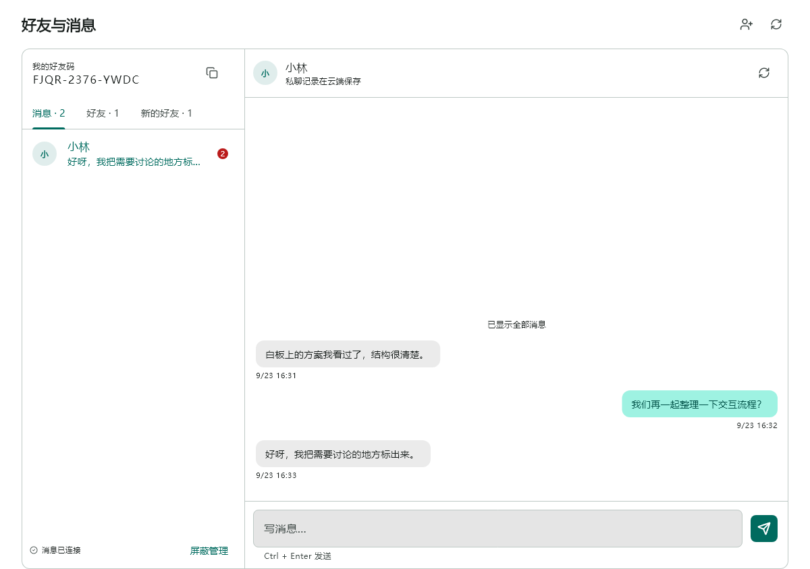
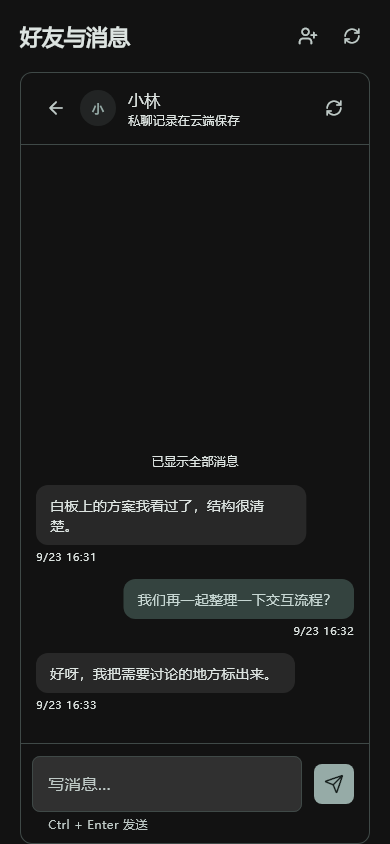

# 好友与私聊阶段验证记录

日期：2026-09-23。分支：`feature/friends-collaboration`。基线：`91cc03a`。

## 实现与发布状态

好友码、申请状态机、删除/屏蔽、文字私聊、历史补查、失败重试、未读及白板消息弹层已实现。服务端 `FLOWMUSE_SOCIAL_ENABLED` 默认关闭，未部署到生产；定向邀请与设备信任尚未实现。不能将本阶段称为完整邀请方案交付。

每项功能和重要修复单独提交。未提交真实凭据、签名材料、构建产物或用户聊天数据。界面图来自本地合成样例。

## 自动检查

| 检查 | 结果与边界 |
|---|---|
| `flutter test --no-pub` | 1751 通过，5 项仓库既有跳过；包括账号切换、分页刷新、失败消息重试、实际可见已读、短暂连接拒绝恢复 |
| `flutter analyze --no-pub` | 无 error；仅既有 `build/nav_compact_screenshot_test.dart:199` 的 protected member warning。新增模块专项分析无问题 |
| Go 测试与 vet | `go test ./...`、`go vet ./...` 通过；鉴权故障修复后重跑 auth/social/collab 与全量 vet 通过 |
| PostgreSQL 迁移与事务 | 独立 PostgreSQL 17 临时容器，数据库 `_test` 后缀、每测试随机 schema；重复迁移、旧账号、并发申请/发送、屏蔽竞态、第三人越权、房间归属与撤销验证通过 |
| Socket.IO | 真实 polling 握手校验 Web `auth.token`、按账号分发、撤销失效；数据库查询故障不投递未经校验的信息，也不误撤销账号。Dart 本地 WebSocket 测试覆盖 namespace 拒绝后恢复 |
| Web release | `flutter build web --release --no-pub` 通过；既有 Wasm dry-run/字体提示仍在，不代表 Wasm 验收 |
| Android debug | `flutter build apk --debug --no-pub` 通过，未做实体设备双账号联调 |
| HAP debug | `flutter build hap --debug --no-pub` 失败：`No Hmos SDK found`；用户已说明本机不恢复 DevEco，未安装工具链或变更签名 |
| UI | 390px 夜间与 1200px 日间截图已人工查看；窄屏 1.5 倍字体、纯文本显示、Ctrl+Enter、弹层遮挡不误已读有 widget 回归 |
| 白板 | 使用真实白板、控制器、SQLite 和内存加密协作的原回归扩充：消息弹层开关后协作仍在线，控制器未替换，点击不穿透；原画笔与撤销流程继续通过 |

现有 CI Quality 仍运行 Go 测试与 vet；未配置测试 DSN 时，数据库集成用例明确跳过，不能据此声称数据库验收通过。上表数据库结果来自本次独立测试容器的实际执行。

新增 PostgreSQL service 的 CI 配置已准备为[待应用补丁](patches/2026-09-23-social-postgres-ci.patch)，但当前 GitHub 凭据缺少 `workflow` 权限，工作流变更被拒绝，尚未应用到分支。补丁同时配置两个测试 DSN，密码仅为一次性测试值。具备工作流写权限后，在仓库根目录运行 `git apply --check docs/研发记录/research/patches/2026-09-23-social-postgres-ci.patch`、`git apply docs/研发记录/research/patches/2026-09-23-social-postgres-ci.patch`，再单独提交并验证 CI。补丁文件本身不会启用数据库服务。

## T03 邀请密码方案门槛

项目已安装 `cryptography 2.9.0`（Apache-2.0），提供 X25519、HKDF-SHA256、AES-GCM 原语；读取其公开 API 和本地实现后，尚未得到可直接接入的完整 HPKE Auth 实现。没有新增密码库，也没有把自行拼接原语接进生产。

`test/features/social/invitation_primitives_probe_test.dart` 在 Dart VM 验证：

- RFC 7748 §6.1 的 X25519 公钥与共享秘密固定向量。
- RFC 5869 A.1 的 HKDF-SHA256 固定向量。
- AES-128-GCM 往返及错误 AAD 拒绝。

这些检查只证明原语当前可用，**不证明 HPKE Auth 已实现或安全可上线**。Chrome 命令启动了独立 headless 浏览器，但超过五分钟仍停留在 loading，未执行测试断言；已结束本次探针进程，原因尚未定位。不得记为浏览器通过。HAP 构建缺 SDK，亦未在鸿蒙真机运行。

尚缺：RFC 9180 A.1.3 Auth 套件全部向量、独立实现互测、固定 AAD/信封编码、异常公钥与篡改防护验证、设备指纹/信任原型和安全评审、Web 与 OHOS 实测。因此 T08/T09、T12–T15 继续等待，服务端明确 `invitations=false`。后续不能只补一次 HAP 构建便自动开放邀请。

复测命令：

```powershell
flutter test --no-pub test/features/social
flutter test --no-pub --platform chrome test/features/social/invitation_primitives_probe_test.dart
flutter build hap --debug --no-pub
```

参考：[RFC 9180](https://www.rfc-editor.org/rfc/rfc9180.html)、[RFC 7748 §6.1](https://datatracker.ietf.org/doc/html/rfc7748#section-6.1)、[RFC 5869 A.1](https://datatracker.ietf.org/doc/html/rfc5869#appendix-A.1)、[cryptography API](https://pub.dev/documentation/cryptography/latest/cryptography/)。

## 上线与回退待办

1. 在打包/测试设备按计划第 7 节完成两账号、多设备、断网恢复、换号、删除与屏蔽验收。纯华为账号无需邮箱；同一账号邮箱/华为登录应共享历史。
2. 记录当前后端镜像、Web release、受控配置与数据库备份；先在测试环境启用 `FLOWMUSE_SOCIAL_ENABLED=true`，确认迁移幂等和老版白板/账号兼容。
3. 发布后端后再发布新 Web/原生 App。开启开关后检查 `/api/social/me`、好友申请、消息落库、多端已读及 `/social` 握手；不向未经用户授权的邮箱发送测试邮件。
4. 紧急关闭使用 `FLOWMUSE_SOCIAL_ENABLED=false` 并重建应用容器；新客户端隐藏入口，账号与白板继续运行。容器重启会短暂断开连接，须确认原协作恢复。
5. 需要版本回退时回到记录的后端镜像/Web release，**保留新增列、表和消息**；不回滚到缺少此前华为/邮箱兼容迁移的旧版。数据库备份恢复只在明确需要且确认写入损失范围后执行。

上述发布与生产回退尚未执行，本记录不等于生产验收。

## UI 样例




