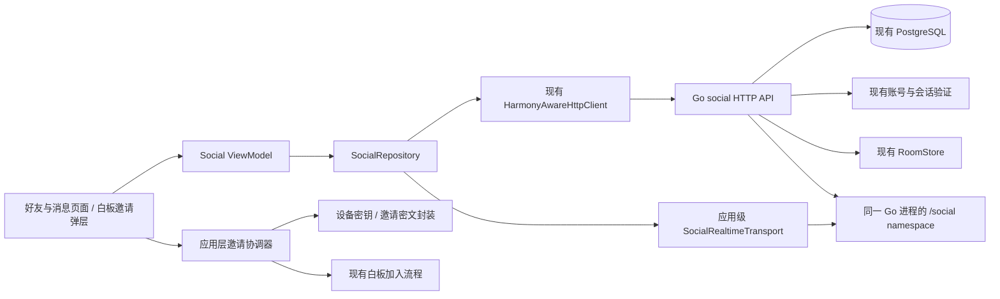

# 好友、私聊与定向协作邀请：分析与设计

日期：2026-09-23
状态：设计稿；本文件描述拟实现行为，尚未开发或上线。
配套任务：[实施任务计划](../plans/2026-09-23-friends-messaging-collaboration.md)

## 1. 结论与产品目标

在现有 FlowMuse 账号下增加好友关系、一对一文字交流和定向协作邀请。最重要的结果是：用户在应用内找到协作者，发出邀请，对方明确接受后进入现有白板；沟通、邀请与白板编辑形成连贯流程。

推荐顺序为：基础鉴权与可行性验证 → 好友 → 应用级消息与邀请收件箱 → 加密邀请与白板接入 → 私聊 → 跨端验收。邀请和私聊复用同一会话中的消息模型，但可以分别开放入口。

以下是本设计的默认决策，不代表功能已经实现：

| 问题 | 首版决策 | 原因与实际边界 |
|---|---|---|
| 身份归属 | 统一绑定服务端 `users.id` | 华为登录、邮箱登录进入同一账号时共享好友、会话和未读状态；邮箱并非必填 |
| 查找好友 | 精确好友码；显示昵称和头像 | 不提供按邮箱、手机号或华为身份搜索；昵称可以重复 |
| 交流范围 | 好友之间的一对一文字私聊 | 支持历史、未读、失败重试；群聊、文件和音视频不纳入首版 |
| 私聊保存 | 用户已确认 HTTPS/WSS 传输，服务端保存文字 | 换设备可加载历史；这不是私聊端到端加密。若未来改变要求，按第 13 节重排计划 |
| 白板保密 | 继续端到端加密 | 白板密钥、场景、附件内容不进入私聊明文、服务端日志或通知摘要 |
| 谁能发定向邀请 | 已登录且拥有该房间的房主 | 首版只邀请已接受的好友；普通编辑者继续使用原有协作方式 |
| 受邀者权限 | 当前已有的 `editor` | 不增加仅查看角色、转让房主或成员踢出 |
| 房间策略 | 保留现有链接协作语义 | 定向邀请是一种密钥交付入口，不将旧房间改成“只有好友能进” |
| 通知范围 | 应用内实时提示；离线收件箱 | 杀进程或系统挂起后不承诺即时提醒；系统推送单列后续阶段 |
| 本地聊天缓存 | 首版按需加载服务器历史、使用内存缓存 | 不新增 SQLite 聊天表；断网可看已加载内容，不承诺冷启动离线历史和崩溃后草稿恢复 |

新增好友不会共享个人笔记库；加入白板仍只进入用户主动选择的协作房间。本功能不增加全量笔记云同步。

## 2. 代码勘察与必须先处理的事项

勘察时基线为 `7bdb210` 加账号功能改动。2026-09-23 这些改动已通过 [PR #50](https://github.com/qinyre/FlowMuse/pull/50) 合并，当前可复现开发基线为 `main` 的 `91cc03a`；后续好友开发从包含该合并的主分支开始。

下列路径均相对仓库根目录，来自本轮实际读取：

| 已有能力或问题 | 依据 | 对设计的影响 |
|---|---|---|
| 用户、邮箱/华为凭据、业务会话与撤销检查已存在 | `FlowMuse-Server/internal/auth/user_store.go`、`http_api.go`、`account_link_store.go` | 复用身份与会话，不建第二套认证 |
| HTTP 身份解析在无凭据或验证失败时可退化为游客 | `auth.HTTPAPI.IdentityFromRequest` | 社交 API 必须显式拒绝游客，不能只拿返回的 Identity 继续操作 |
| 房间、成员与邀请表已经建过 | `internal/storage/room_store.go:EnsureSchema` | 复用 `room_invites`，补字段和索引；当前它没有完整邀请业务 |
| `access_policy` 默认 `link_guest` | `room_store.go`、`internal/collab/http_api.go` | 不把已有字段误当成已实现的成员访问控制 |
| 重复创建房间会执行成员写入，返回元数据也直接使用传入 ownerID | `room_store.go:CreateRoom` | 新邀请上线前修正冲突路径：已存在房间的归属不可被调用方改变或伪装 |
| 不存在的房间可能返回默认元数据，而非不存在错误 | `room_store.go:LoadRoom` | 邀请必须用明确的存在性检查；不能依据非空 roomId 或默认角色推断房间真实存在 |
| Socket.IO 服务端当前身份读取主要依赖 Authorization header | `internal/collab/hub.go:identityFromSocket` | 补握手 `auth.token` 路径及浏览器测试；不能假设 WebSocket 自定义请求头可用 |
| 现有客户端连接跟随白板房间建立与销毁 | `collaboration/services/socket_io_realtime_transport.dart` | 社交通知独立为应用级 `/social` namespace，不挂在白板生命周期上 |
| 房间链接包含 `roomId,roomKey` | `collaboration/models/collaboration_room.dart` | 不能把完整链接直接写入明文聊天消息 |
| 白板加密为 AES-GCM-128；已有 `cryptography 2.9.0` | `collaboration_crypto.dart`、`pubspec.lock` | 保留场景协议；邀请另做小型密钥封装，不更改白板加密格式 |
| 加入流程已经负责解密、初始化场景和连接协作 | `CollaborationRepository.joinRoom` | 邀请解密成功后交给原流程，不再开发另一套白板加入逻辑 |
| 房主离开页面按结束协作处理 | `.agent/decisions.md` ADR-017、`whiteboard_page.dart` | 邀请好友和边写边聊使用弹层/侧面板，避免导航离开导致房间结束 |
| 导航、网络、安全存储都有跨端实现 | `AppShell`、`HarmonyAwareHttpClient`、`AuthTokenStore` | 复用现有组件与平台适配；社交 UI 不直接调用 ArkTS |
| 本地 SQLite 当前为 v5 | `shared/storage/local_database.dart` | 本设计首版不新增聊天 SQLite schema，不触发无必要的全端本地迁移 |

房间问题目前是代码审阅发现，需要在前置任务中用隔离数据库测试复现、修复。不得把未经生产验证的代码路径描述成已发生的账号或数据事件。

## 3. 使用流程和界面

### 3.1 入口与布局

- 在现有侧边栏增加一个“好友与消息”入口，右侧显示未读数；内部用“消息 / 好友 / 新的好友”切换。
- 宽屏使用列表与会话双栏，窄屏列表点击进入会话。沿用 `AppShell` 的 820px 紧凑断点、现有主题、`AppSpacing` 与页面骨架。
- 账号设置展示可复制的好友码。纯华为账号同样可用，不要求先绑定邮箱。
- 游客打开入口时显示登录引导，登录成功后回到原目标；不阻碍本地笔记和原游客链接协作。
- 白板协作菜单增加“邀请好友”和“消息”弹层。消息弹层不销毁白板页面、不重置当前画布，也不获取手写输入区域的持续焦点。
- 所有页面要覆盖首次加载、空列表、断网、会话过期、发送中、发送失败和重试状态；按钮有文本或无障碍说明。

### 3.2 添加好友

1. A 输入 B 的完整好友码，获得最小公开资料预览；不显示 B 的邮箱、登录提供商或在线设备。
2. A 提交好友申请，可附不超过 100 字的验证文字。
3. B 在“新的好友”里接受或拒绝；接受事务同时建立唯一的一对一会话。
4. A/B 同时互发时，服务器返回已有待处理关系，由 UI 提示接受对方申请，不悄悄替双方完成同意。
5. 删除好友停止未来私聊与邀请，已有会话历史保持可读；重新添加需再次接受。
6. 屏蔽是单向操作、双向阻止新交互。解除屏蔽不自动恢复好友关系。

好友码是检索标识，不是登录密码或授权凭据。默认 12 位随机易读大写字符，显示时分组；生成时依赖数据库唯一约束处理碰撞。仅支持登录后精确匹配，不开放全量用户目录。

### 3.3 一对一文字消息

- 打开好友详情可以“发消息”；会话只允许两个固定参与者读取。
- 文字长度上限为 2,000 个 Unicode 码点，UTF-8 编码后不超过 8 KiB；纯空白拒绝，作为纯文本渲染，不执行 HTML/Markdown。
- 点击发送后显示“发送中”；收到后端落库确认才显示“已发送”。不把“已发送”解释为对方已读。
- 超时后允许使用同一 `clientMessageId` 重试；服务端去重并返回原消息。
- 当前设备打开会话且应用在前台、对应消息实际进入可读视区后，推进自己的已读游标；后台到达消息不自动清零。
- 登录同一账号的其他设备看到相同历史和账号级未读；用户退出或换号时立刻清除内存会话、草稿、待发任务与旧连接。
- 没有新增持久发送队列。断网时保留当前页面草稿并提示恢复网络后发送；已提交成功的内容始终以服务器历史为准。

### 3.4 发起与接受协作邀请

1. A 打开已有笔记，按现有确认流程创建协作房间，等首个加密快照和房间元数据就绪。
2. A 选择好友 B；客户端获取 B 已登记且经 A 验证的接收设备公钥，用自己的设备私钥认证发送方，把房间密钥封装成设备专用密文信封。首次使用时双方完成设备安全卡核验。
3. 服务端检查 A 的当前会话、真实房主身份、A/B 好友关系、屏蔽状态、房间存续和信封结构，在一个事务中保存邀请和邀请卡片。
4. B 在线时收到应用内提示；离线时保留卡片，下次打开后同步。邀请默认 24 小时有效，房间结束会提前使其失效。
5. B 点击“加入”，客户端先检查当前工作是否需要保存/结束；不能覆盖本地笔记或默默结束 B 正在主持的房间。
6. 后端重新核验接收人、请求的设备归属、关系及房间状态，发回该设备对应的密文信封。B 用已验证的 A 设备公钥和自己的私钥解密并核对邀请上下文；缺少发送设备信任时先引导核验。
7. 通过原 `CollaborationRepository.joinRoom` 加载和解密场景、建立连接；白板确实就绪后再确认“已加入”。
8. 跳转使用内存对象与邀请 ID 路由；不把解密密钥放进新邀请 URL 的 query、服务端参数或社交通知。

未登记设备、首次设备安全验证、新设备无法解密历史邀请、房主暂时无法重新封装等情况应有可执行提示，详见第 7 节。普通消息可以离线投递，不等于设备换新后自动拥有旧邀请密钥。

## 4. 状态与权限

### 4.1 好友关系

用一条规范排序的用户对记录当前关系，状态为 `pending / accepted / declined / cancelled / removed`；屏蔽独立存储，不混入同一互斥状态。

| 操作 | 发起方 | 前置条件 | 结果 |
|---|---|---|---|
| 发申请 | 任意已验证账号 | 非本人、双方未屏蔽、未达频率/数量上限 | 建立或重新开启 pending，记录申请人和版本 |
| 接受/拒绝 | 当前申请的接收人 | pending、版本匹配、双方未屏蔽 | accepted/declined；接受时确保唯一会话 |
| 撤回 | 当前申请人 | pending、版本匹配 | cancelled |
| 删除好友 | 任一好友 | accepted | removed；撤销未完成定向邀请 |
| 屏蔽 | 任一账号 | 非本人 | 建立屏蔽、移除关系、撤销未完成邀请 |
| 解除屏蔽 | 屏蔽发起人 | 自己的屏蔽记录 | 只移除屏蔽，关系不自动恢复 |

每次状态变化增加 `version`。客户端创建/重新申请与 action 请求都携带 `expectedVersion`，不存在关系时为 0；过时返回 409 并刷新。关系行保存当前申请的 `request_client_id`：同一申请 ID、相同归一化正文的重试只返回当前状态，不重新开启申请；同 ID 不同正文返回 409。重新申请必须带当前版本和新的 ID，较早一轮的重试不能恢复已撤回或已删除的关系。action 在同一轮申请已达到目标状态时可幂等返回，不能跨轮次重放。

### 4.2 邀请与“已加入”的区分

持久状态：`pending / accepted / declined / revoked`；到期和房间结束作为读取时计算的有效状态 `expired / room_ended`。`accepted` 表示用户已接受，不表示网络连接一定成功。

- UI 另有短暂的“正在加入 / 加入失败，可重试”状态；只有原加入流程完成后才写入 `joined_at` 并显示“已加入”。
- 成功确认必须属于接收用户，并检查有效邀请、房间和成员记录；`joined_at` 表示客户端报告曾成功加入，不证明此刻在线，不用它授予任何权限。发送者界面可显示“对方已确认加入”，不能将其展示为实时在线状态。
- 相同邀请的接收用户可在有效期和未撤销期间重复获取自己设备的信封、重试加入，不把网络重试设计成不可恢复的一次性动作。
- 拒绝仅接收人可做，撤销仅创建者可做。撤销、删除好友和屏蔽阻止今后获取信封，不保证清除已经交付到对方设备的密钥。
- 未收到邀请的用户、归属其他账号的设备或不可见的 invitationId，统一返回不泄露存在性的 404。首版不新增设备持有证明协议：同账号 token 可请求该账号名下未撤销设备的密文，但不能替代相应私钥解密；不能声称服务端仅凭 deviceId 就识别了真实物理设备。

### 4.3 本期不改变的房间安全语义

已有房间仍按链接持有者协作。收到密钥的人可以另行分享它；删除好友也不会自动踢出已加入房间的人。若需要真正撤销既有访问，需要单独设计成员访问策略、连接驱逐及密钥轮换，本期不能声称已提供这些能力。

原 `ownerKey` 仅房主持有，绝不放进发给好友的邀请。新 API 的发起者权限查数据库真实 `owner_id`；客户端展示继续使用可信房间元数据的 `isOwner`。

## 5. 系统结构



客户端新增 `features/social` 四层模块，应用层协调器负责跨 feature 编排。对外经 Provider 暴露好友选择、发邀请、处理邀请等能力，不让聊天 Repository 导入编辑器内核。白板密钥只在端侧封装步骤使用，不放进可序列化的通用事件对象。

服务端增加 `internal/social`，持久化查询收敛到其 store 或 `internal/storage/social_store.go`；扩展已有 `room_invites` 的业务由一处负责。仍用一个 Go 服务、一个 PostgreSQL，不新建聊天微服务、Redis 或消息队列。

`/social` 与原白板 namespace 隔离，使用同一 Socket.IO 服务。客户端社交连接归账号生命周期管理，首版允许独立 Manager，避免白板 disconnect 意外关闭消息连接；不为了共享底层 TCP 先重构现有协作连接。[Socket.IO namespace 文档](https://socket.io/docs/v4/namespaces/)

## 6. 数据设计

以下为逻辑 schema，开发时写入幂等 PostgreSQL 迁移。主键沿用当前项目的字符串 ID 风格；HTTP 时间为毫秒，数据库时间为 `TIMESTAMPTZ`。

| 表 | 字段概要 | 约束与索引 |
|---|---|---|
| `users`（扩展） | `friend_code,social_keyset_version` | friend_code 可空迁移、非空唯一，首次获取社交资料时生成；账号级密钥集合版本为 BIGINT NOT NULL DEFAULT 0 |
| `social_relationships`（新增） | `id,user_low_id,user_high_id,requester_id,request_client_id,state,version,request_message,created_at,updated_at` | `low < high`；用户对唯一；申请人必须为其中一方；当前申请 `(requester_id,request_client_id)` 唯一；按两侧用户/state 建索引 |
| `social_blocks`（新增） | `blocker_id,blocked_id,created_at` | 复合主键、不可屏蔽自己；两方向查询索引 |
| `direct_conversations`（新增） | `id,relationship_id,user_low_id,user_high_id,last_seq,low_read_seq,high_read_seq,updated_at` | 每对用户唯一；会话参与者创建后不可替换；read_seq 初始 0 |
| `direct_messages`（新增） | `conversation_id,seq,id,sender_id,client_message_id,kind,body_text,invite_id,created_at` | `(conversation_id,seq)` 唯一；`(sender_id,client_message_id)` 唯一；kind 只允许 text/invitation；两种正文互斥 |
| `social_devices`（新增） | `id,user_id,key_id,public_key,key_fingerprint,platform_label,created_at,last_seen_at,revoked_at` | 同用户 key_id 唯一；设备公钥不可原地替换，换钥登记新 key_id；不存私钥 |
| `room_invites`（扩展） | 既有字段加 `recipient_id,conversation_id,client_invite_id,status,version,accepted_at,joined_at,revoked_at` | 新格式必须有接收人/会话；`(created_by,client_invite_id)` 唯一；按接收人/status/时间建索引 |
| `room_invite_envelopes`（新增） | `invite_id,recipient_user_id,device_id,key_id,sender_device_id,sender_key_id,suite,enc,ciphertext,created_at` | 每邀请/接收设备/key 唯一；发送设备归属创建者、接收设备归属接收人；受大小限制；不存完整分享链接 |

设计细节：

1. 首版一对一会话固定两位参与者，不建通用群成员或动态权限框架。删除好友只改变关系，保留会话参与者以读取历史。
2. 涉及额度、首次关系创建或设备集合时，先按 userId 排序锁相关 users 行，再依次锁关系、房间、邀请和会话；不需要的锁跳过，所有入口不逆序获取。首次申请和无关系时屏蔽也遵循这个顺序，避免“没有关系行可锁”留下竞态；屏蔽、删除、接受、发消息的并发行为有明确事务边界。
3. 同一会话在事务内 `UPDATE ... last_seq = last_seq + 1 RETURNING last_seq` 分配序号，再插消息；不能使用非事务序列并把最大已见 ID 当成可靠同步进度。消息序号按十进制字符串传给 Web，避免 BIGINT 超出 JavaScript 精确整数范围。
4. 重试命中 `client_message_id` 时比较会话和归一化正文；同 ID 不同内容返回 409，不悄悄覆盖。邀请重试同理。
5. 未读数统计对方消息中 `seq > my_read_seq` 的数量，不能简单用 `last_seq - read_seq`，否则会把自己消息算进去。读游标用 `GREATEST` 单调推进，并限制到真实存在的消息序号。
6. `room_invites` 旧行可能没有 recipient_id。迁移保留这些行，新 API 仅处理可验证的新格式；不删除旧数据、不凭空把旧邀请分配给账号。
7. 新设备必须登记新公钥；失效设备的信封停止下发。登记/撤销在 users 行锁下递增该账号的 `social_keyset_version`，好友设备列表返回整体 `keysetVersion`；发邀请在同样的锁下校验版本与所有目标设备，不在每台设备上独立计集合版本。设备数首版建议最多 5 个，达到上限引导用户撤销旧设备，不自动删除密钥。
8. 首版云端历史保留，删除好友不等于删除双方历史；后续若增加清理期限/清空入口，应单独定义其是否只影响本人。隐私说明写明实际保存方式，备份也不得误称端到端加密私聊。

## 7. 邀请密钥交付设计与发布门槛

### 7.1 为什么登录 token 不够

登录证明“谁在操作”，不能替代接收人的端侧解密密钥。华为登录可以没有密码，邮箱密码可以重置，因此不能用密码哈希、业务 token、邮箱或 UnionID 派生白板密钥，也不能让服务器替用户生成并持有可解密的设备私钥。

方案比较：

| 方式 | 使用体验 | 结论 |
|---|---|---|
| 聊天里明文保存完整协作链接 | 最省实现，服务器得到 roomKey | 违反现有协作保密约束，排除 |
| 只有邀请通知，接受时等待房主在线临时交付 | 无长期设备密钥，但双方必须同时在线 | 可作为明确缩减后的方案；不作为当前默认，因为离线接受与跨设备体验较弱 |
| 每台接收设备持有私钥，服务器存加密信封 | 已登记设备可异步接收，新设备需重发/重新验证 | 推荐；只做邀请密钥交付，不扩展成全量加密聊天和密钥备份系统 |

### 7.2 设备、可信公钥与多端

- 每个账号在每个安装实例生成独立 X25519 密钥对。私钥通过已有支持 OHOS 的 secure-storage facade 保存；公钥、设备 ID 和版本登记到服务器。
- 私钥按 `serverOrigin + userId + deviceId + keyId` 隔离。退出清空内存和连接；安全存储中的设备私钥保留供同账号再次登录使用，显式“移除此设备”才撤销并删除。恢复读取失败时创建新设备，不能用空密钥继续。
- 已验证设备指纹也按当前账号与服务器隔离保存在安全存储，不能经普通笔记导入、云端设备列表更新或另一个账号的缓存自动建立信任。
- 服务器下发的公钥**不能仅因在列表中出现就自动成为可信设备**。首版提供包含版本、服务地址、用户 ID、好友码、设备 ID、keyId 和完整公钥指纹的“设备安全卡”；双方通过可信外部渠道复制/核对，分别固定对方设备指纹。公钥既用于加密给接收设备，也用于接收时验证发送设备。
- 短好友码只负责检索。首次邀请一个未验证设备时先完成安全卡核验；新设备或换钥重新验证，不自动用旧信任覆盖。指纹从接收设备本机公钥生成，不从服务器显示值反推“验证成功”。
- 这样增加一次设备配对步骤，之后可一键邀请。若要省略配对、改用仅信任服务器公钥目录，须明确重新评估主动公钥替换风险，不能悄悄削弱 ADR-007 的保护范围。
- 用户在鸿蒙和安卓的好友、文字历史完全共享；邀请解密能力取决于该设备是否有对应信封。新设备收到旧卡片时显示“需要发送者为本设备重新发送”，不自动恢复旧密钥、不把密钥交给服务器代管。
- 首版不加扫码依赖，先支持复制粘贴安全卡和指纹核对；QR 是同一公开载荷的后续展示方式。

### 7.3 信封格式与实现策略

推荐使用 RFC 9180 HPKE 的固定单次封装：Auth 模式，DHKEM(X25519, HKDF-SHA256)、HKDF-SHA256、AES-128-GCM。它用发送设备私钥认证发送端，并把已有 roomKey 交给指定设备，不替换白板 AES-GCM 场景协议。[RFC 9180](https://www.rfc-editor.org/rfc/rfc9180.html)

现有 `cryptography 2.9.0` 提供 X25519、HKDF、AES-GCM 原语，**不能据此宣称项目已有 HPKE 实现**。实施第一步是确认可维护的兼容实现；若基于现有原语封装固定套件，必须严格按 RFC、已知向量及独立实现互测验证，不自行设计新的密码协议。[cryptography API 文档](https://pub.dev/documentation/cryptography/latest/cryptography/)

```text
outer = { version:1, suite, inviteId, roomId, senderId, recipientId,
          senderDeviceId, senderKeyId, recipientDeviceId, keyId,
          expiresAt, enc, ciphertext }
plaintext = { version:1, inviteId, roomId, roomKey, senderId, recipientId,
              senderDeviceId, senderKeyId, recipientDeviceId, keyId, expiresAt }
aad = [1, inviteId, roomId, senderId, recipientId,
       senderDeviceId, senderKeyId, recipientDeviceId, keyId, expiresAtDecimalString]
```

`info` 绑定固定用途 `FlowMuse/room-invite/v1`；AAD 为上面的固定顺序 JSON 数组，用统一编码函数输出无额外空白的 UTF-8。标识字段限定为项目 ID 使用的 ASCII 字符，到期时间按 Unix 毫秒的十进制字符串编码，不依赖对象键顺序或本地时间格式。外层元数据与解密正文逐项匹配。`enc` 解码后为 32 字节，ciphertext 长度、算法版本、公钥类型和 Base64URL 解码均严格校验；roomKey 解码后必须是现有 16 字节格式。

每次新封装生成新的临时密钥，不复用封装上下文处理另一个设备或另一份邀请。重试已提交的同一邀请则复用完全相同请求或读取服务器既有结果，不能用相同请求 ID 替换密文。

Auth 模式的发送设备公钥也必须来自已核验的本地信任记录，不能直接信任服务器为卡片附带的新公钥。HTTP 会话和真实房主校验负责业务权限，HPKE 负责端侧密钥交付与发送设备认证；只有 Base 模式会留下服务器伪造发送设备的缺口，因此本方案不采用 Base。前端代码分发与设备本身被攻破属于另一个威胁范围，不能宣称一个信封解决所有攻击。

**发布门槛**：标准测试向量、错误接收者/设备、AAD 篡改、重放、丢钥与跨 Dart VM/Web/OHOS 的实际验证全部通过，并完成密码协议代码审阅。未通过时邀请功能保持不可用，好友及云端文字消息可单独交付；不得降级为上传明文 roomKey。

### 7.4 邀请事务与密文更新

1. 客户端生成 inviteId/clientInviteId，读取已验证设备及 keysetVersion，完成封装后提交。
2. 后端在事务内重新检查关系、真实房主、房间未结束、发送设备属于创建者且未撤销、接收设备属于接收人且未撤销、keysetVersion 未变化，再写邀请、信封、会话卡片；任一失败全部回滚。发送者和接收者 users 行按 ID 排序锁定，和设备撤销保持一致。
3. 提交时公钥集合发生变化返回 409；客户端刷新后重新封装，不能悄悄漏掉撤销校验。
4. 补发给新设备只能由原邀请创建者、在仍持有 roomKey 且房间有效时进行，并完成双方实际发送/接收设备的指纹验证；补发只增加该设备的新信封，不替换其他设备已有信封。发送设备撤销后停止领取它产生的旧信封，可由创建者的有效且已验证设备重新发起邀请。
5. 发起方已离线且当前设备没有信封时显示等待/联系发送者；房间已结束则显示失效。
6. 系统收件箱和聊天卡片只存 inviteId 与状态，默认标题“协作白板”。笔记标题不自动作为明文元数据上传。

## 8. HTTP 契约

统一 `/api/social` 前缀。以下均要求有效 token、活跃会话和 `HasVerifiedIdentity`。请求中的 senderId、userId 不作为操作者身份依据。

| 方法与路径 | 输入/输出要点 | 权限与行为 |
|---|---|---|
| `GET /me` | 本人好友码、未读摘要、客户端能力版本 | 好友码懒生成，旧账号无需迁移等待 |
| `POST /people/lookup` | `{friendCode}` → 最小公开资料与本人关系版本 | 精确查找；无关系版本为 0；屏蔽/不存在统一处理，不泄露第三人关系 |
| `GET /relationships?state=&cursor=&limit=` | 好友或申请分页 | 只返回本人参与关系 |
| `POST /relationships` | `{friendCode,requestMessage,clientRequestId,expectedVersion}` | 当前申请去重、防自加、数量限制；旧版本不能重新开启申请 |
| `POST /relationships/{id}/actions` | `{action,expectedVersion}` | action 为 accept/decline/cancel/remove；按角色校验 |
| `GET /blocks` | 本人屏蔽列表 | 仅本人可读 |
| `POST /blocks` | `{userId}` | 幂等屏蔽，事务内停止新交互 |
| `POST /blocks/{userId}/remove` | 空 body | 仅解除自己的屏蔽 |
| `GET /conversations?cursor=&limit=` | 对方最小资料、最后消息、unreadCount | 只返回本人会话；默认 20、最多 100 |
| `GET /conversations/{id}/messages` | `beforeSeq` 或 `afterSeq`，默认 50、最多 100 | 两种游标互斥；不使用 offset；邀请卡片返回当前有效状态 |
| `POST /conversations/{id}/messages` | `{clientMessageId,text}` | accepted 好友、未屏蔽；客户端不能创建伪造邀请类型 |
| `PUT /conversations/{id}/read` | `{throughSeq}` | 单调推进本人游标，返回未读摘要 |
| `POST /devices` | 公钥、安全卡标识、平台标签 | 登记当前账号设备；同 keyId 不同公钥冲突 |
| `GET /devices` | 本人设备与状态 | 不返回私钥 |
| `POST /devices/{id}/revoke` | 空 body | 只撤销本人设备，停止其信封获取 |
| `GET /friends/{userId}/devices` | 好友接收设备的公钥、指纹、keysetVersion | 仅有效好友可查；读取不等于发送端已经验证信任 |
| `GET /invitations?direction=&cursor=&limit=` | 发出/收到的邀请 | 持久收件箱和重连补查 |
| `POST /invitations` | 邀请上下文、keysetVersion、密文信封集合 | 房主、好友、未屏蔽、有效房间；同时创建会话卡片 |
| `GET /invitations/{id}` | 元数据及当前有效状态 | 发起者/接收者可读，无 roomKey |
| `POST /invitations/{id}/accept` | `{deviceId,keyId}` | 接收者操作，设备必须归属本人且未撤销；返回该设备信封，允许网络失败后重试 |
| `POST /invitations/{id}/decline` | `{expectedVersion}` | 接收者拒绝 |
| `POST /invitations/{id}/revoke` | `{expectedVersion}` | 创建者撤销 |
| `POST /invitations/{id}/joined` | 空 body | 接收者确认白板就绪；不新增权限 |
| `POST /invitations/{id}/envelopes` | 新设备信封及 keysetVersion | 原创建者为已验证新设备补发 |

采用现有鸿蒙网络支持的 GET/POST/PUT，不因这批 API 扩大 PATCH 适配或遗漏 DELETE 的跨域预检。若开发中改为 DELETE，必须同步 CORS 与真机测试。

错误响应统一为 `{code,message,retryAfterSeconds?}`，只对新模块采用，不在此任务中重构旧账号 API。401 会话失效，403 无权限，404 不可见/不存在，409 版本或幂等冲突，410 已结束/过期，413 请求过大，429 限流，503 模块不可用；后端数据库错误和请求正文不直接返回给用户。

建议首版限额（设计默认，验收后可调整）：200 个好友、50 条待处理申请、每日 20 次新申请、每用户每分钟 60 条文字消息（突发 10）、同房间同好友每分钟 1 次新邀请、单请求 64 KiB、每设备信封至多 2 KiB。重试既有已落库请求返回原结果，不能额外消耗发送额度。

## 9. 实时、可靠性与生命周期

- 新增 `/social` namespace，只允许已验证用户。业务 token 放握手 auth 或 Authorization；Web 路径必须能仅用 `auth.token` 工作，不把 token 放 query。
- 服务器根据真实 userId 加入内部 `user:{id}` 收件组；不暴露“加入任意用户房间”命令。
- Socket 只发送 `relationship.changed / conversation.changed / invitation.changed / session.revoked` 等提示，内容限 ID、版本和序号；文字正文、信封和私密资料通过重新鉴权的 HTTP 拉取。
- 所有变更先提交数据库，再发送实时提示；重连、登录、应用恢复前台后重新拉取摘要并补齐当前会话消息。
- Socket.IO 默认并不为断线用户可靠保存所有事件，因此不能把实时广播当成聊天历史。[Socket.IO 投递保证](https://socket.io/docs/v4/delivery-guarantees/)
- 首版前台每 30 秒补查摘要，覆盖“落库成功但通知丢失且连接未断”的情况。通知突发合并刷新，后台暂停该轮询；按会话 seq 去重，应用/账号 generation 不匹配的响应直接丢弃。
- 拉取历史和实时补查并发时保留消息 ID/seq 集合，不能用旧页面响应覆盖新消息。打开另一会话只更换订阅状态，不重建整个账号连接。
- 退出、改密、重置密码导致 session 撤销时，断开对应社交连接；推送前及周期性检查会话有效性，过期连接不能无限接收提示。客户端 401 后停止重试，回到登录状态。
- 每用户连接数有上限，重连使用退避和抖动；同一账号的两个设备互不关闭对方的正常连接。Socket Manager 缓存、旧 token 复用是专项测试项。
- 首版按单 Go 实例部署。`ponytail:` 跨实例实时广播未接入共享 adapter；需要扩容多个应用副本时再加入共享分发，数据库拉取仍为事实源。达到该阶段前不宣称多实例实时通知可用。

## 10. 跨端与消息体验边界

| 平台 | 首版要求 | 验证方式 |
|---|---|---|
| 鸿蒙 | 好友、文字、加密邀请、应用内提示；华为与邮箱身份统一 | 打包电脑构建 HAP；真机验证网络、密钥读写和授权链路 |
| Android | 同账号好友/历史/未读同步，邮箱登录及邀请 | 构建 APK，真机双端联合验收 |
| Web | REST、握手鉴权、刷新/深链、浏览器存储限制 | HTTPS 浏览器实测，特别是 WebSocket 仅 auth.token 的情况 |
| Windows/macOS/iOS | 共享代码可编译，原入口与本地笔记不回归 | 有工具链的平台构建与冒烟；未实测平台明确记录 |

Web 密钥存储受同源脚本与浏览器数据清理影响，不承诺硬件安全隔离或清理后恢复。复用安全存储 facade 时必须单独验证实际 Web 实现，不因为接口同名就声称达到移动端密钥保护等级。

新邀请深链只携带 inviteId；未登录先登录、再回到邀请，returnTo 仅允许本应用白名单路径。当前设备无信封给出补发引导。首次成功进入后仍走原白板保存/退出语义，不把好友笔记自动存入本人笔记库。

本轮不在当前电脑恢复 DevEco。本机负责设计、共享代码与可运行检查；HAP 签名、构建和鸿蒙真机测试在具备环境的电脑完成。

## 11. 隐私、滥用防护与运行边界

- 所有会话、关系、设备和邀请读写都检查当前用户归属；“知道 ID”不构成访问权。好友资料投影与本人账号详情分开，不能直接复用含邮箱的完整 User 响应。
- 已登录限流以 userId/动作类型为主；未登录入口结合真实受信任代理配置限制来源。不能直接信任任意 `X-Forwarded-For`，也不能让所有合法用户共享一个 Nginx 回环 IP 限额。
- 删除好友/屏蔽和发送的竞态经同一关系行锁串行化；屏蔽事务提交后的新发送必须失败。此前已提交的历史仍可读。
- 私聊输入识别现有协作链接/房间码时，引导转成邀请卡片，不把完整链接上传为普通文字；服务端同样拒绝可识别的 FlowMuse 密钥链接格式。这是防误传措施，不声称能识别用户任意编码的秘密。
- 文字、验证说明、token、设备私钥、roomKey、ownerKey、密文正文均不记录到调试或生产日志；只记录请求 ID、结果码、耗时、计数和必要脱敏标识。
- 按已确认的云端私聊方案，上线时同步应用隐私说明，准确说明消息正文、关系、设备公钥和未读状态的保存；不能把“白板端到端加密”描述成“全部聊天服务器不可读”。
- 社交加载、网络失败和服务停机不阻塞本地笔记打开。服务端模块可以关闭读写入口，已有账号登录与旧链接协作保持可用。
- 容量先通过真实压测和指标确定；关注发送失败率、通知到达时延、补查恢复率、数据库查询耗时与磁盘增长，不预先购买第三方 IM 或系统推送套餐。

## 12. 验收标准与主要风险

验收必须覆盖以下结果：

1. 华为先登录且未绑定邮箱的用户可添加好友；绑定邮箱后 Android 登录仍是同一关系与会话。
2. 两用户同时申请、重复接受、删除/屏蔽与发送并发，不产生重复关系、双会话或越权消息。
3. 任意修改请求中的 userId、conversationId、inviteId、deviceId，不能读取第三人数据或给自己扩权。
4. 私聊断网重试、通知丢失、后端重启、前后台切换和多端阅读后，消息不重复、未读不回退。
5. 只有真实房主可以发定向邀请；不存在、结束或过期房间明确失败；普通成员不能借重复 CreateRoom 获得邀请资格。
6. 房间密钥不在数据库明文、API 普通正文、日志、通知或新邀请 URL 中出现；用专门测试密钥做自动扫描，失败信息不打印该密钥。
7. 错误设备、未验证公钥、换钥、密文或上下文被修改时，不能进入白板；旧信任不自动扩展给新增设备。
8. 从个人笔记或另一个房间接受邀请，先保护当前工作；不合并两张白板、不误保存远端内容到个人原笔记。
9. 房主打开邀请/私聊弹层后房间继续存在，书写与协作连接不被销毁；应用内提醒不抢笔触。
10. 原匿名链接协作、邮箱注册/找回密码、华为登录、白板 AES-GCM/LWW、附件同步、导出和备份回归通过。

最高风险是邀请的可信公钥与跨设备密钥生命周期，其次是共享鉴权改动对 Web 协作的影响、白板导航生命周期、消息发送与屏蔽并发。相关任务必须先于邀请正式发布，不能只靠 UI 隐藏入口替代权限校验。

## 13. 如果选择私聊也端到端加密

需增加设备间消息扇出、发送者多端可读、设备配对/撤销、历史密钥恢复或明确不可恢复语义、密钥轮换、跨端信任变更提醒；未读与会话元数据仍可在服务端维护。不能简单用一个后端持有的固定 AES 密钥加密消息后称作端到端加密，也不能把 roomKey 复用为私聊长期密钥。

届时先替换消息正文与设备信任设计，再实现文字发送；当前好友、身份、会话 ID、邀请状态和页面结构仍可复用。具体工期需在恢复方式与协议库验证后重估，不把这部分隐含进默认首版工期。

## 14. 依据与限制

- 仓库规则：`AGENTS.md`、`.agent/conventions.md`、`.agent/architecture.md`、ADR-007/012/013/017、《架构约束》；冲突时以根 AGENTS 和用户明确约束为准。
- [Socket.IO namespace](https://socket.io/docs/v4/namespaces/)：用于划分社交和白板事件；当前 Go 实现与 Dart 客户端的具体 API、重连行为仍需编译及集成验证。
- [Socket.IO 投递保证](https://socket.io/docs/v4/delivery-guarantees/)：用于设计持久化、幂等和补拉，不将网络事件视为可靠历史。
- [cryptography API](https://pub.dev/documentation/cryptography/latest/cryptography/)（项目锁定 2.9.0）与 [RFC 9180](https://www.rfc-editor.org/rfc/rfc9180.html)：用于邀请密码方案验证；当前仓库尚无已验证 HPKE 封装或设备信任体系。
- 本设计未读取新的生产账号数据、未更改生产数据库或发送通知。方案中新增 API、表、文件和测试均为待实现内容。
